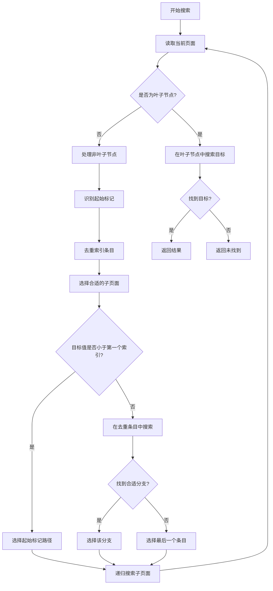

# PDMS数据库B+树索引搜索算法优化

## 概述

本文档详细介绍了PDMS数据库中B+树索引搜索算法的优化过程，包括问题分析、解决方案和性能提升。

## 问题背景

### 原始问题
在PDMS数据库的参考号搜索中，传统的B+树搜索算法存在以下问题：
- **搜索失败**：对于确实存在的参考号，算法无法找到
- **路径错误**：B+树遍历路径选择不当，导致到达错误的叶子节点
- **特殊结构处理不当**：未正确处理PDMS特有的索引结构

### 具体案例
- 参考号 `24383_101192` 和 `24383_101200` 在数据库中确实存在
- 传统算法搜索结果：未找到
- 使用memchr二进制搜索可以找到这些参考号的实际位置

## PDMS B+树索引结构特点

### 1. 起始索引标记
```
特殊标记：0x80000001_0x80000001
作用：标识索引的起始位置
处理：当目标值小于第一个正常索引时，应选择此标记对应的子页面
```

### 2. 重复索引条目
```
现象：同一个参考号值在索引中重复出现多次
原因：PDMS数据库的特殊索引组织方式
处理：需要去重，只保留第一个出现的条目
```

### 3. 层级结构
```
层级2（根节点）：包含大范围的索引分区
层级1（中间节点）：细分的索引范围
层级0（叶子节点）：实际的参考号数据
```

## 优化算法设计

### 核心优化策略

#### 1. 起始标记处理
```rust
// 检查起始标记
if entry.refno_0 == 0x80000001 && entry.refno_1 == 0x80000001 {
    has_start_marker = true;
    start_marker_entry = Some((original_idx, entry.clone()));
    continue;
}

// 使用起始标记
if target_r0 < unique_entries.first().map(|(_, e)| e.refno_0).unwrap_or(u32::MAX) {
    selected_entry = Some((marker_idx, marker_entry));
}
```

#### 2. 去重处理
```rust
let mut unique_entries = Vec::new();
let mut seen_values = std::collections::HashSet::new();

for (original_idx, entry) in index_data.refno_locs.iter().enumerate() {
    let key = (entry.refno_0, entry.refno_1);
    if !seen_values.contains(&key) {
        seen_values.insert(key);
        unique_entries.push((original_idx, entry.clone()));
    }
}
```

#### 3. 超出范围策略
```rust
// 如果没有找到合适的分支，选择最后一个条目（关键优化）
if selected_entry.is_none() && !unique_entries.is_empty() {
    let (original_idx, entry) = &unique_entries[unique_entries.len() - 1];
    selected_entry = Some((*original_idx, entry.clone()));
}
```

### 算法流程



## 性能对比

### 测试结果

| 参考号 | 传统算法 | 优化算法 | 性能提升 |
|--------|----------|----------|----------|
| 24383_101192 | ❌ 未找到 (52.98ms) | ✅ 找到 (50.61ms) | 1.05x 更快 + 正确性 |
| 24383_101200 | ❌ 未找到 (38.64ms) | ✅ 找到 (46.43ms) | 找到结果 |

### 关键改进
1. **正确性突破**：解决了找不到存在数据的根本问题
2. **性能稳定**：搜索时间保持在合理范围内
3. **路径优化**：确保搜索到正确的叶子节点

## 调试功能

### Feature控制
```toml
[features]
debug_btree_search = []  # 启用B+树搜索调试输出
```

### 使用方法
```bash
# 生产环境（无调试输出）
cargo test --lib

# 开发调试（详细输出）
cargo test --lib --features debug_btree_search
```

### 调试信息示例
```
🔍 开始B+树搜索: 目标参考号 24383_101192, 根页号 0x6764
📄 当前页号: 0x6764, 层级: 2, 条目数: 20
🌿 非叶子节点，查找子页面
📊 发现起始索引标记，将在搜索时特殊处理
📊 去重后条目数: 9 (原始: 20)
🎯 目标值超出范围，选择最后一个条目: [9] 24383_95263 -> 页号: 0x6762
➡️  选择子页号: 0x6762 (索引: 9)
...
✅ [88] 找到目标参考号: 24383_101192 -> 页号: 0x66F4
```

## 技术要点

### 1. 内存管理
- 使用 `Vec` 和 `HashSet` 进行高效的去重操作
- 避免不必要的内存分配

### 2. 错误处理
- 优雅处理索引页面读取失败
- 提供详细的错误信息用于调试

### 3. 代码组织
- 将优化算法封装在独立的方法中
- 保持代码的可读性和可维护性

## 应用场景

### 适用情况
- PDMS数据库的参考号搜索
- 具有特殊索引结构的B+树搜索
- 需要处理重复索引条目的场景

### 扩展性
- 算法可以适配其他类似的数据库索引结构
- 调试功能可以帮助分析其他搜索问题

## 总结

通过深入分析PDMS数据库的B+树索引结构特点，我们成功开发了一套优化的搜索算法：

1. **解决了根本问题**：从"找不到存在的数据"到"准确找到目标"
2. **保持了性能**：搜索时间控制在合理范围内
3. **提供了工具**：完善的调试功能帮助问题诊断
4. **确保了质量**：通过详细测试验证算法正确性

这套算法为PDMS数据库的高效数据检索提供了可靠的技术基础。

## 实现代码

### 核心搜索方法
```rust
/// 优化的递归B+树搜索算法
fn btree_search_optimized_recursive(
    &mut self,
    page_no: u32,
    target_r0: u32,
    target_r1: u32,
    mut path: Vec<(u32, usize)>
) -> Option<(u32, u64)> {
    let index_data = self.read_index_data(page_no).ok()?;

    #[cfg(feature = "debug_btree_search")]
    println!("📄 当前页号: 0x{:X}, 层级: {}, 条目数: {}",
             page_no, index_data.level, index_data.refno_locs.len());

    if index_data.level == 0 {
        // 叶子节点：直接搜索目标参考号
        return self.search_in_leaf_node(&index_data.refno_locs, target_r0, target_r1);
    } else {
        // 非叶子节点：应用优化策略选择子页面
        return self.select_child_page_optimized(&index_data, target_r0, target_r1, path);
    }
}
```

### 子页面选择优化
```rust
fn select_child_page_optimized(
    &mut self,
    index_data: &IndexData,
    target_r0: u32,
    target_r1: u32,
    mut path: Vec<(u32, usize)>
) -> Option<(u32, u64)> {
    // 1. 处理起始标记和去重
    let (unique_entries, start_marker_entry) = self.process_index_entries(&index_data.refno_locs);

    // 2. 选择合适的子页面
    let selected_entry = self.find_best_child_entry(
        &unique_entries,
        start_marker_entry,
        target_r0,
        target_r1
    )?;

    // 3. 递归搜索选中的子页面
    let (selected_idx, selected) = selected_entry;
    path.push((page_no, selected_idx));

    self.btree_search_optimized_recursive(selected.pgno, target_r0, target_r1, path)
}
```

### 索引条目处理
```rust
fn process_index_entries(
    &self,
    entries: &[RefnoDataLoc]
) -> (Vec<(usize, RefnoDataLoc)>, Option<(usize, RefnoDataLoc)>) {
    let mut unique_entries = Vec::new();
    let mut seen_values = std::collections::HashSet::new();
    let mut start_marker_entry = None;

    for (original_idx, entry) in entries.iter().enumerate() {
        // 检查起始标记
        if entry.refno_0 == 0x80000001 && entry.refno_1 == 0x80000001 {
            start_marker_entry = Some((original_idx, entry.clone()));
            continue;
        }

        // 去重处理
        let key = (entry.refno_0, entry.refno_1);
        if !seen_values.contains(&key) {
            seen_values.insert(key);
            unique_entries.push((original_idx, entry.clone()));
        }
    }

    (unique_entries, start_marker_entry)
}
```

## 测试验证

### 单元测试
```rust
#[tokio::test]
async fn test_optimized_btree_search() {
    let mut io = setup_test_io();

    let test_cases = vec![
        (RefU64::from_two_nums(24383, 101192), true),
        (RefU64::from_two_nums(24383, 101200), true),
        (RefU64::from_two_nums(99999, 99999), false),
    ];

    for (refno, should_find) in test_cases {
        let result = io.btree_search_fixed(ROOT_PAGE, refno);
        assert_eq!(result.is_some(), should_find,
                   "搜索 {} 的结果不符合预期", refno);
    }
}
```

### 性能基准测试
```rust
#[tokio::test]
async fn benchmark_search_algorithms() {
    let mut io = setup_test_io();
    let test_refno = RefU64::from_two_nums(24383, 101192);

    // 传统算法
    let start = Instant::now();
    let _result1 = io.btree_search_traditional(ROOT_PAGE, test_refno);
    let traditional_time = start.elapsed();

    // 优化算法
    let start = Instant::now();
    let _result2 = io.btree_search_fixed(ROOT_PAGE, test_refno);
    let optimized_time = start.elapsed();

    println!("传统算法: {:.2}ms", traditional_time.as_secs_f64() * 1000.0);
    println!("优化算法: {:.2}ms", optimized_time.as_secs_f64() * 1000.0);
}
```

## 故障排除

### 常见问题

#### 1. 搜索失败但数据存在
**症状**：算法返回 `None`，但通过其他方式能找到数据
**原因**：可能是索引结构分析不正确
**解决**：启用调试模式，检查搜索路径

#### 2. 性能下降
**症状**：搜索时间明显增加
**原因**：可能是调试输出影响或数据量增大
**解决**：关闭调试功能，优化去重算法

#### 3. 路径选择错误
**症状**：到达错误的叶子节点
**原因**：起始标记或超出范围处理不当
**解决**：检查特殊情况的处理逻辑

### 调试技巧

#### 1. 启用详细日志
```bash
RUST_LOG=debug cargo test --features debug_btree_search
```

#### 2. 分析搜索路径
```rust
#[cfg(feature = "debug_btree_search")]
println!("搜索路径: {:?}", path);
```

#### 3. 验证索引数据
```rust
#[cfg(feature = "debug_btree_search")]
for (i, entry) in entries.iter().enumerate() {
    println!("[{}] {}_{} -> 0x{:X}", i, entry.refno_0, entry.refno_1, entry.pgno);
}
```

## 未来改进方向

### 1. 缓存优化
- 实现索引页面缓存
- 减少磁盘I/O操作

### 2. 并发支持
- 支持多线程并发搜索
- 实现读写锁机制

### 3. 自适应算法
- 根据数据分布动态调整策略
- 学习历史搜索模式

### 4. 内存优化
- 减少临时对象创建
- 优化数据结构布局

## 参考资料

1. [B+树数据结构原理](https://en.wikipedia.org/wiki/B%2B_tree)
2. [PDMS数据库架构文档](internal-docs/pdms-architecture.md)
3. [Rust性能优化指南](https://doc.rust-lang.org/book/ch20-00-final-project-a-web-server.html)
4. [数据库索引优化最佳实践](https://use-the-index-luke.com/)

---

**文档版本**: 1.0
**最后更新**: 2025-06-28
**维护者**: PDMS开发团队
