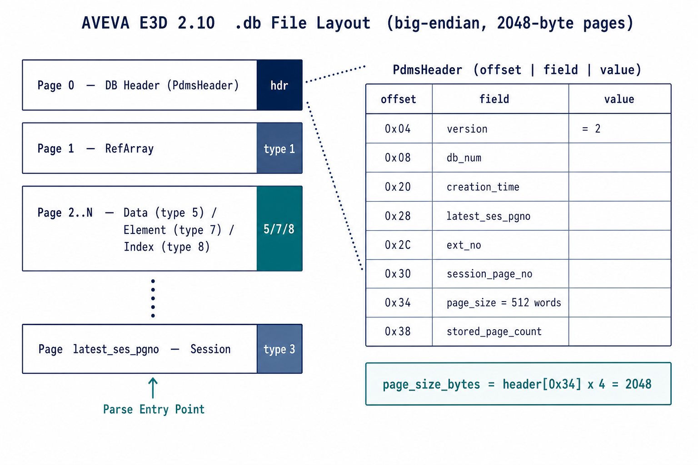

# AVEVA E3D / PDMS 数据库(.db)文件格式规范

> 版本基线:**AVEVA Everything3D 2.10**（IDB:`D:\AVEVA\Everything3D2.10\core.dll.i64`，镜像基址 `0x10000000`）。
> 本规范由「现有分析文档 + Rust 实现(`src/defines.rs`)地面真值 + 实时 IDA(ida-pro-mcp)逆向 + 真实样本十六进制走查」四方交叉核验得到。
> 凡标注 **[实测]** 的字段均在真实样本上逐字节解码验证；**[IDA]** 表示由 core.dll 2.10 反编译确认；**[存疑]** 表示尚未完全确定。

---

## 0. 通用约定

| 项 | 约定 |
| :--- | :--- |
| 字节序 | **大端 (big-endian)**。所有多字节整数高位在前。[实测] |
| 基本字元 | 32 位字 (DWORD = 4 字节)。文件内很多"长度/大小"字段以**字 (word)** 为单位，需 ×4 得字节数。 |
| 页 (Page) | 文件按固定大小分页，页号 `pgno` 从 0 开始。页 0 为数据库描述符(头部)。 |
| 引用号 (refno) | 元素的全局标识，由两个 32 位整数 `(refno_0, refno_1)` 组成的 64 位值。 |
| extno | extent/会话扩展号，区分主库与各 extract。 |

---

## 1. 文件整体布局

```
+=====================================================================+
| Page 0   数据库描述符 / 头部 (PdmsHeader, 0x40 字节有效)            |
+---------------------------------------------------------------------+
| Page 1   引用数组页 (type 1)                                        |
+---------------------------------------------------------------------+
| Page 2..N  数据页(type 5) / 元素页(type 7) / 索引页(type 8) / ...   |
+---------------------------------------------------------------------+
| ...                                                                 |
| Page (latest_ses_pgno)  最新会话页 (type 3)  ← 解析入口            |
+=====================================================================+
```

### 1.1 页大小(关键，含纠错)

**页大小 = `header[0x34]` × 4 字节**。`header[0x34]` 是「每页的 32 位字数」，**不是字节数**。[实测][IDA]

> ⚠️ **纠错**:旧版 `e3d_db_reader*.py`、`FILELIST.md` 以及 Rust `defines.rs::detect_page_size()` 把 `header[0x34]`(值 = `0x200` = 512)直接当作**字节数**，从而误判为 512 字节页。实际所有 E3D 2.10 样本该字段都是 `512 字`，即 **2048 字节**。db1 层全局变量 `页面大小 = dword(字数) × 4` 的注释也印证了这一点。

四个样本的实测交叉验证(均 `version=2`):

| 文件 | 大小(B) | db_num | `header[0x34]` | =页字节 | page1 类型 | `latest_ses_pgno` 页类型 |
| :--- | ---: | ---: | ---: | ---: | :--- | :--- |
| `pdms-test-data/sam7200_0001` | 6,930,432 | 7200 | 512 字 | **2048** | 1 | 3(会话) |
| `test-file/acp7002_0001` | 16,799,744 | 7002 | 512 字 | **2048** | 1 | 3(会话) |
| `test-file/ams1112_0001` | 103,786,496 | 1112 | 512 字 | **2048** | 1 | 3(会话) |
| `test-file/amssys` | 15,298,560 | 8191 | 512 字 | **2048** | 1 | 3(会话) |

> 验证方法:取 `latest_ses_pgno × 2048` 处的第一个大端 u32 恒为 `0x00000003`(会话页类型)；`1 × 2048` 处恒为 `0x00000001`；按 512 字节去算则全为 0/乱码。

代码层面建议把 `detect_page_size` 改为:`bytes = header.page_size_words * 4`（保留 512/2048/4096 字节合法性校验作兜底）。

---

## 2. Page 0 — 数据库描述符 / 头部 `PdmsHeader`

结构定义见 `src/defines.rs::PdmsHeader`（大端，0x40 字节）。下表第 4 列为 `sam7200_0001` 的 **[实测]** 值。

| 偏移 | 大小 | 字段 | sam7200 实测 | 含义 |
| :--- | :--- | :--- | :--- | :--- |
| 0x00 | 4 | `unknown_0_0` | 0 | 未知(恒 0) |
| 0x04 | 4 | `version` | **2** | 文件格式版本(E3D 2.x 恒为 2) |
| 0x08 | 4 | `db_num` | **0x1C20 = 7200** | 数据库编号(与文件名 sam**7200** 对应) |
| 0x0C | 4 | `unknown_1_0` | 1 | 未知(恒 1) |
| 0x10 | 4 | `unknown_1_1` | 1 | 未知(恒 1) |
| 0x14 | 4 | `unknown_1_2` | 0 | 未知(恒 0) |
| 0x18 | 4 | `flags` | 0xFFFFFFFF | 标志位(恒 -1) |
| 0x1C | 4 | `unknown_1_4` | 0 | 未知(恒 0) |
| 0x20 | 4 | `creation_time` | **0x0B0692 = 722578** | 创建时间(PDMS 纪元编码) |
| 0x24 | 4 | `unknown_2` | 0xFFFFFFFF | 未知(恒 -1) |
| 0x28 | 4 | `latest_ses_pgno` | **0x0D37 = 3383** | **最新会话页号**(解析入口) |
| 0x2C | 4 | `ext_no` | 1 | extent/扩展号 |
| 0x30 | 4 | `session_page_no` | 3 | 基础/首会话页号 [存疑:与最新会话页区分见 §4] |
| 0x34 | 4 | `page_size`(**字数**) | **0x200 = 512 字 → 2048 字节** | 见 §1.1 |
| 0x38 | 4 | `stored_page_count` | 0x3C20 = 15392 | 声明的存储页计数 [存疑:与 文件字节/2048 不完全一致] |
| 0x3C | 4 | `unknown_3` | 2 | 未知(恒 2) |

`sam7200_0001` page0 原始字节(前 0x40):

```
0000  00 00 00 00 00 00 00 02 00 00 1C 20 00 00 00 01
0010  00 00 00 01 00 00 00 00 FF FF FF FF 00 00 00 00
0020  00 0B 06 92 FF FF FF FF 00 00 0D 37 00 00 00 01
0030  00 00 00 03 00 00 02 00 00 00 3C 20 00 00 00 02
```

---

## 3. 页类型体系

### 3.1 一级页类型(页首大端 u32)

见 `src/defines.rs::PageType`。[实测:page1=1, latest_ses=3, page3=5]

| 值 | 名称 | 说明 |
| :--- | :--- | :--- |
| 1 | RefArray 引用数组页 | 引用/桶相关数组 |
| 3 | Session 会话页 | 一次编辑会话的元数据 + 索引根/声明根(见 §4) |
| 5 | Data 数据页 | 通用数据页，子类型由页首魔数细分(见 §3.2) |
| 7 | Special 特殊页 | **元素页**承载体(EleRawData，见 §6) |
| 8 | Index 索引页 | B-树索引(见 §5) |

### 3.2 数据页子类型(魔数，页首大端 u32)

见 `src/defines.rs::DataPageSubtype`。桶 ID 编码在魔数的 13–25 位:`bucket_id = (magic >> 13) & 0x1FFF`。

| 魔数 | 名称 | 关联模块 |
| :--- | :--- | :--- |
| `0x00743F11` | 主数据页 | db4 |
| `0x00743F49` | 主数据页(变体，E3D 常见) | db4 |
| `0x00CC5D1F` | 辅助数据页 | db2 |
| `0x00CC47DF` | 辅助/B+树索引页 | db3(见 §5 `IndexPageData.noun` 断言) |
| `0x05256C75` | 索引数据页 | db3 |
| `0x03C0A13F` | 属性数据页 | db4 |
| `0x03F22C60` | 扩展数据页 | db2 |
| `0x0009C18E` | 元素数据页 | db4 |

---

## 4. 会话页(type 3)— `SessionPageData`

会话页是解析的**起点**:由 `header.latest_ses_pgno × page_size` 定位最新会话页，从中取得索引根页号，进而遍历全部元素。结构见 `src/defines.rs::SessionPageData`(大端)。

| 偏移 | 字段 | 含义 |
| :--- | :--- | :--- |
| 0x00 | `page_type` | 恒 3 |
| 0x04 | `last_ses_pageno` | 上一会话页号(会话链表) |
| 0x08 | `last_ses_extno` | 上一会话扩展号 |
| 0x0C | `sesno` | **会话编号** |
| 0x10 | `unknown_0` | 恒 0xFFFFFFFF |
| 0x14 | `end_pgno` | 会话最后一页页号 |
| 0x18 | `end_extno` | 会话最后一页扩展号 |
| 0x1C | `index_root_pageno` | **索引根页号**(指向 B-树根，见 §5) |
| 0x20 | `index_root_extno` | 索引根扩展号 |
| 0x24 | `claim_pageno` | 声明(claim)页号 |
| 0x28 | `claim_extno` | 声明扩展号 |
| 0x2C | `unknown_1` / 0x30 `unknown_2` | 未知 |
| 0x34 | `year` / 0x38 `month` / 0x3C `hours` / 0x40 `seconds` | **时间戳**(见下) |
| 0x44 | `unknown_u32[13]` | 13 个未知 32 位整数 |
| 0x78 | `name_words_len` | 计算机名长度(字，≤9) |
| 0x7C.. | `name_bytes` | 计算机名(`name_words_len×4` 字节，填充到 36 字节) |
| .. | `comments_words_len` + `comments_bytes` | 注释长度(字) + 注释内容 |
| .. | `remain_bytes` | 余量 |

时间戳解码(见 `SessionPageData::get_dt`):`days = hours / 24`、`hour = hours % 24`、`minute = seconds / 60`、`second = seconds % 60`，组合 `year-month-day hour:minute:second`。

> 另有更紧凑的会话索引视图 `SesIndexesData`(同前 0x14 字节，随后 `claim_data_*`、`index_root_*`、`claim_root_*` 各 8 字节)，用于只取索引根的场景。

---

## 5. 索引页 / refno → 物理位置(B-树)

E3D 用 B-树把 **refno(64 位)** 映射到元素数据的**物理位置**。相关结构见 `src/defines.rs`。

### 5.1 索引根页 `RootIndexPage`
`page_type` / `noun` / `unknowns_0[4]` / `residual_num`(剩余 = `0x200 - residual_num`) / `lock[2]` / `last_pageno` / `last_extno` / `lower_root`(RefnoIndexPgId) / `upper_root`(RefnoIndexPgId)。

### 5.2 索引中间/数据页 `IndexPageData`
| 字段 | 含义 |
| :--- | :--- |
| `page_type` | 页类型 |
| `noun` | **恒 `0xCC47DF`**(断言)，对应 §3.2 "辅助/B+树索引页" |
| `level` | B-树层级 |
| `unknowns[3]` / `pfno` | 未知 / 前驱页号 |
| `refno_locs: Vec<RefnoDataLoc>` | 条目列表，遇 u32=0 终止 |

### 5.3 条目 `RefnoDataLoc`(核心定位结构)
| 偏移 | 字段 | 位宽 | 含义 |
| :--- | :--- | :--- | :--- |
| 0x00 | `refno_0` | 32 | refno 高 32 位 |
| 0x04 | `refno_1` | 32 | refno 低 32 位 |
| 0x08 | `pgno` | 32 | 目标页号 |
| 0x0C | `offset` | **20 位** | 页内偏移(以**字**计) |
| 0x0C+ | `flag` | **12 位** | 标志位 |

**元素属性数据的实际字节偏移**:
```
att_byte_offset = pgno × page_size + offset × 2
```
（`offset` 字段以 2 字节为单位；见 `RefnoDataLoc::get_att_offset_with_page_size`。`page_size` 取 §1.1 实际值 2048。）

起始页判定:`refno_0 == 0x80000001 && refno_1 == 0x80000001`。

---

## 6. 元素页(type 7)— `ElePageData` / `EleRawData`

元素页承载真正的元素记录。结构见 `src/defines.rs`。下例为 `pdms-test-data/ele_data_0`(正好 2048 字节，一整页)的 **[实测]** 解码。

### 6.1 页头
| 偏移 | 字段 | 实测 | 含义 |
| :--- | :--- | :--- | :--- |
| 0x00 | `flag` | 7 | 元素页标志(对应 type 7) |
| 0x04.. | `eles_vec` | — | 元素记录数组，遇 u32=0 终止 |

### 6.2 元素记录 `EleRawData`
| 偏移 | 字段 | ele_data_0 实测 | 含义 |
| :--- | :--- | :--- | :--- |
| +0x00 | `implicit_flag` (u16) | 0x0000 | 隐式数据标志 |
| +0x02 | `implicit_count` (u16) | 0x002E = 46 | 隐式数据长度(字) |
| +0x04 | `ref0` (i32) | 0x5C20 | refno 高位 |
| +0x08 | `ref1` (i32) | 0x161A | refno 低位 |
| +0x0C | `noun` (i32) | 0x97247 | **元素类型** = base-27 db1_hash;`db1_dehash(0x97247)="WELD"`(见 §7.5) |
| +0x10 | `parent_ref0` | 0x5C20 | 父元素 refno 高位 |
| +0x14 | `parent_ref1` | 0x1615 | 父元素 refno 低位 |
| +0x18 | `page_no` (u32) | 0x0D22 | 关联页号 |
| +0x1C | `implicit_data` | (46-7)×4 = 156 B | 隐式属性数据(当 `implicit_flag==0`) |
| .. | `members` (可选 `EleMembers`) | — | 子成员列表(当其首 u16==0x2) |
| .. | `explicit_flag` / `explicit_count` | — | 显式属性区头 |
| .. | `explicit_data` | (count-1)×4 B | 显式属性数据(当 `explicit_flag==1`) |

`ele_data_0` 原始字节(前 0x20):
```
0000  00 00 00 07 00 00 00 2E 00 00 5C 20 00 00 16 1A
0010  00 09 72 47 00 00 5C 20 00 00 16 15 00 00 0D 22
```

### 6.3 成员列表 `EleMembers`
`flag`(u16) + `len`(u16) + `refno`(u32,u32) + `unknown_0`(u32,u32) + `children: Vec<(u32,u32)>`(数量 `(len-4)/2`)。承载父子层次。

---

## 7. 属性二进制编码

元素属性分**隐式(implicit)**与**显式(explicit)**两段(见 §6.2)。属性按「**属性名码 → 描述符(类型/大小/偏移)→ 按类型读值**」解析，由 db4 层完成。[IDA]

- 属性名码在 `db4_get_ce_att` 中先减去常量 **531442** 再做范围校验(`<= 0x17179147`)。[IDA `0x10612A50`]
- `db4_get_att_dets`(`0x10611FF0`)在**元素类型定义表**中按属性码线性查找描述符:遍历步进 `desc += *(desc+60)`，匹配 `*(desc+56)==att_code`；命中后描述符关键字段:`+0x08`=类型索引、`+0x0C`=大小。[IDA]
- 类型索引用于双精度换算表 `dbl_10F68E90[type]`(实型/坐标的定点↔浮点缩放)。[IDA]

属性数据类型(对应 db4 取值 API):整型 `db_get_integer`、实型 `db_get_real`、字符串 `db_get_string`、逻辑 `db_get_logical`、引用 `db_get_reference`、以及各类数组/表属性(`db_get_int_array` / `db_get_ref_array` / 表属性)。NOUN 属性元数据(把 noun + 属性码映射到名称/类型)由运行时字典维护，详见配套《解析指导》与 `DB_Noun属性元数据获取机制.md`。

### 7.1 属性数据类型码（attlib TYPE 字段）

| 码 | 类型 | 存储(words) | 字节 |
| :-- | :-- | :-- | :-- |
| 1 | Integer | 1 | 4 |
| 2 | Real(Double) | 2 | 8 |
| 3 | Boolean | 位打包 | — |
| 4 | Reference(元素引用) | 2 | 8 |
| 5 | Text(字符串) | 变长(4 字节/字符步长) | — |
| 6 | Enum / Word | 1 | 4 |
| 7 | Position | 6 | 24 |
| 8 | Direction | 3 | 12 |
| 9 | Orientation | 9 | 36 |
| 10 / 11 / 12 | Int / Real / Ref 数组 | 变长 | — |

存储方式 DEFI:`1 = DAB`(物理存于元素隐式区)、`4 = Pseudo`(伪属性，计算或来自显式/成员块)。来源:`crates/parse_pdms_db/.../attlib::AttrDataType / AttrDefiType`。

### 7.2 隐式区属性 offset 编码

每个 DAB 属性的 `offset` 字段定位它在元素**隐式区**中的位置:

| 规则 | 条件 | 解码 |
| :-- | :-- | :-- |
| Pseudo | `offset == 0` | 不在隐式区(由 PseudoAttPlugger 计算或来自显式/成员块，如 NAME/DESC/OWNER) |
| 直接字偏移 | `0 < offset < 0x100000` | `byte = offset × 4`(相对隐式区起始) |
| BOOL 位打包 | `offset ≥ 0x100000` | `bit_index = offset >> 20`，`word_offset = offset & 0xFFFFF`(多个 BOOL 共享一个 word) |

> 例(PIPE 的 word[12]):`BUIL`=bit0、`SHOP`(0x10000C)=bit1、`LISS`(0x20000C)=bit2。

### 7.3 元素记录细化布局

`EleRawData`(§6)按记录展开:
```
[隐式头]   impl_len_words | refno(8B) | noun_hash(4B) | owner/parent(8B) | 头部字段...
[隐式 payload]  按各属性 offset 定位的 DAB 值(见 §7.2)
[成员块]   (可选, flag=0x0002)  子元素 refno 数组
[显式块]   (可选, flag=0x0001)  [attr_hash(4B)][type_code(2B)][data_len_words(2B)][data...] ×N
[UDA 块]   (可选)  以特殊表属性承载:UDATAB/UDAFTB(type14)、UDASTB(type18),随显式/DA 区存储(见 §7.7.7 / §7.9)
[结束]     0x00000000  (下一记录/页常以 0x00000007 起)
```
> [存疑] 隐式头确切字数在两份来源间略有差异(`defines.rs` 记 7 dword vs 完整指南记 11 word)；属性 offset 以隐式区/payload 起点为基准，建议以 `defines::EleRawData` + 实测对齐为准。

### 7.4 attlib.dat — 属性库文件（独立分页文件）

noun↔属性 的**元数据本身不在各 .db 里**，而在 `attlib.dat`(分页 2048B；样本 `test-file/attlib.dat` ≈4.6MB)。core.dll 2.10 内含对应字符串与读取函数(均 [IDA] 确认):`ATNAIN`/`ATGTDF`/`ATGTIX`/`ATGTSX`、`ATTLIB Attribute/Noun Index|Definition|Defaults|Syntax`、路径 `/%AVEVA_DESIGN_EXE%/attlib.dat`、以及 `getattlib/GAT*`、`attlib/QATT*` 函数族。

`ATTOPE/sub_10851210` 先用 `FHFIND(..., "OLD, READ")` 打开 attlib,再读目录 record 2 的 8 个 u32。`FHDBRN` 使用 **1-based record number**:record `N` 对应物理文件页 `N-1`。

| 目录项 | 实测值 | 装载函数 | 运行时表 | 含义 |
| :-- | :-- | :-- | :-- | :-- |
| `v47[0]` | `0x0003` | `ATGTDF/sub_10852E20` | `dword_11BC9880[0x4000...]` | DB_Attribute 字段定义 |
| `v47[2]` | `0x0693` | `ATGTIX/sub_10852A64` | `unk_11BC1880` + `dword_11BC9880[0..0x3FFF]` | attribute hash → `(record,disp)` |
| `v47[4]` | `0x06CD` | `ATGTDF/sub_10852E20` | `unk_11C12080` + `dword_11C12210` | DB_Noun 字段定义 |
| `v47[6]` | `0x08BC` | `ATGTIX/sub_10852A64` | `unk_11BFA080` + `dword_11C02080` | noun hash → `(record,disp)` |
| `v47[3]`,`v47[7]` | `0x06A8`,`0x08C2` | `sub_108533B4` | `unk_11BEA050` / `unk_11C1A850` 等 | defaults/syntax/aux 表,待进一步命名 |

`ATGTIX/sub_10852A64` 的记录格式固定为:

```
[hash:u32, combined:u32]*
record = combined / 512
disp   = combined % 512
0       -> 继续下一 record
0xFFFF_FFFF -> 段结束
```

`ATGTDF/sub_10852E20` 的记录格式为:

```
[hash:u32, value:u32, kind:u32, optional-ext...]*
kind=1 -> 无扩展
kind=2 -> 后接扩展值;当 value=4 时先接 count,再接 count 个扩展 word
0       -> 继续下一 record
0xFFFF_FFFF -> 段结束
```

基于 IDA 反编译 + `test-file/attlib.dat` 原始字节探针,可复现实测:

| 表 | 数量 | 例子 |
| :-- | :-- | :-- |
| Attribute ATGTIX(`v47[2]`) | 256 | `POS(0x853B1) -> idx27, record=1129, disp=127, combined=0x8D27F` |
| Attribute ATGTDF(`v47[0]`) | 63 | `SIZE(0x9E770)->idx1`, `TYPE(0x9CCA7)->idx10`, `DEFI(0xAE18D)->idx13`, `NAME(0x9C18E)->idx7` |
| Noun ATGTIX(`v47[6]`) | 256 | `WELD(0x97247)->idx82, record=2225, disp=1`;`PIPE(0x9CAF3)->idx111, record=2059, disp=332` |
| Noun ATGTDF(`v47[4]`) | 88 | `DISPLY(0x15D01CF2)->idx14`, `FOLDER(0x0F970A7F)`, `UPGNOS(0x10C6071F)` |

属性元数据读取路径:

- `DB_Attribute::ReadData(0x1045F900)` 调 `DB_Attribute::internalGetField` 读取 `SIZE/DEFI/TYPE/DTYP/UNIT/NAME/...`。
- `DB_Attribute::internalGetField(vector<int>)(0x1045F800)` 包装 `ATAAIN/sub_10850888`。
- `ATAAIN/sub_10850888` 使用 attribute ATGTIX 定位属性对象,再用 Attribute ATGTDF 的 field index 取字段值。
- 对 `ATAINT/sub_1085001C` 这类 int 字段,矩阵单元先给出 `ptr`,标量值为 `page[disp + ptr - 2]`。
- 对 string 字段,首 word 为长度,后续每 word 的低字节为字符。
- POS 属性示例(静态 `attlib.dat` 可复现):

```
POS(0x853B1) -> attribute ATGTIX idx27, record=1129, disp=127
SIZE  = 3
TYPE  = 8
DEFI  = 5
DTYP  = 2
UNIT  = 0xE54BF ("DIST")
NAME  = "POS"
CATEG = "Positional"
```

Noun 元数据读取路径:

- `DB_Noun::ReadData(0x10457D00)` 调 `DB_Noun::internalGetField` 读取 `VISI/TOPF/FOLDER/UPGNOS/...`。
- `DB_Noun::getDisplayAttributes(0x10458CA0)` 通过 `DB_Noun::internalGetField(DISPLY=0x15D01CF2)` 获取显示属性 hash 列表,再用 `DB_Attribute::findAttribute` 转成属性对象。
- `DB_Noun::internalGetField(vector<int>)(0x10457AA0)` 包装 `ATNAIN/sub_1084F7C0`。
- `ATNAIN/sub_1084F7C0` 使用 noun ATGTIX 定位 noun 对象,再用 Noun ATGTDF 的 field index 取字段值。
- WELD 的 Noun 示例(静态 `attlib.dat` 可复现):

```
WELD(0x97247) -> noun ATGTIX idx82, record=2225, disp=1
WELD.DISPLY(13):
  ANGL, ARRI, HEIG, ISPE, LEAV, MTOC, MTOT, ORI, POS, PTNO, SPRE, TSPE, WLDN
WELD.PRDISP(28):
  FLNN, LOCK, OWNER, ISPE, SPRE, CATTEX, MATR, TSPE, PRLS, APOS, LPOS,
  POS, ORI, BUIL, SHOP, ABOR, ACON, ADIR, ARRI, ARRHEI, ARRWID,
  LBOR, LCON, LDIR, LEAV, LEAHEI, LEAWID, SPLT
```

其中 `POS/ORI/ISPE/MTOC/SPRE/TSPE` 等可在 Attribute ATGTIX 中继续解析为 `DB_Attribute` 元数据;部分条目可能是伪属性、系统属性或需走默认/辅助表。

WELD 中可继续解析为 Attribute 元数据的条目示例:

| 属性 | hash | TYPE | SIZE | DEFI | UNIT | CATEG |
| :-- | :-- | :-- | :-- | :-- | :-- | :-- |
| ISPE | `0x9CBFA` | 5 | — | 5 | — | Specification |
| MTOC | `0x92F7A` | 6 | 1 | 5 | — | Isodraft |
| ORI | `0x83787` | 9 | 3 | 5 | NONE | Positional |
| POS | `0x853B1` | 8 | 3 | 5 | DIST | Positional |
| SPRE | `0x9D165` | 5 | — | 4 | — | Specification |
| TSPE | `0x9CC05` | 5 | — | 5 | — | Specification |

> 注意:`POS` 是 Attribute ATGTIX 中的属性 hash,不是 DB_Noun ATGTDF 字段。离线解析命名属性时,应先复刻 `DB_Attribute::internalGetField` 获取属性元数据(`SIZE/DEFI/TYPE/...`),再通过 noun 侧字段(`DISPLY`/有效属性列表等)取得 noun→attribute 关联。

### 7.5 名称哈希 db1_hash（base-27，偏移 0x81BF1）

⚠️ **纠错**:noun / 属性名用的是 **base-27 + 偏移 `0x81BF1`(531441)** 的可逆哈希(权威实现 `rs-core/src/tool/db_tool.rs`),**不是 base-26**。本仓库旧件 `noun_hash_table.json` 与 `NOUN属性元数据完整指南.md §5` 写的 base-26 公式(给出 PIPE=0x463E9)是**错误**的。已用正确算法重生成全部 1932 项 → **`noun_hash_table_base27.json`**(经 `db1_dehash` 往返校验一致;请改用该文件,旧 `noun_hash_table.json` 作废)。

```
# 字符值: 'A'..'Z' = 1..26, ' ' = 0  (即 ord(c)-64);name[0] 为最低位
db1_hash(name):
    h = 0
    for c in reversed(name):  h = h*27 + (ord(c)-64)
    return h + 0x81BF1
db1_dehash(hash):
    k = hash - 0x81BF1
    s = ''
    while k > 0:  d = k%27;  s += (' ' if d==0 else chr(d+64));  k //= 27
    return s
# UDA 特例:hash > 0x171FAD39 时按 (hash-0x171FAD39)%0x1000000 的 base-64 解码，前缀 ':'
```

实测验证(均经本算法核对一致):

| 名称 | 正确哈希(base-27) | 旧错误值(base-26) |
| :-- | :-- | :-- |
| PIPE | `0x9CAF3` (641779) | ~~0x463E9~~ |
| ELBO | `0xCA439` (828473) | — |
| NAME | `0x9C18E` (639374) | — |
| WELD | `0x97247` (619079) | — |
| USER | `0xD943A` (889914) | — |

> 旁注:`NAME` 的哈希 `0x9C18E` 恰等于 §3.2 中"元素数据页"魔数 —— 二者数值相同。

---

## 7.6 属性 offset 的权威机制（db4，IDA 2.10 反编译实测）

§7.2 的 offset 编码规则此前由实测推断;现已由 `core.dll` 2.10 反编译**逐行确认**。读取一个命名属性值的运行时链路为 `db4_get_ce_att → db4_get_att_dets`,两者都在**当前元素(CE)上下文** `dword_11599348` 上工作。[IDA]

### 7.6.1 描述符查找:`db4_get_att_dets`（`0x10611FF0`，自证版本码 4.5.1）

每个元素类型(noun)在内存里有一份**类型定义表**(type-def),CE 上下文是 60 字节/项的数组:

| CE 项偏移 | 含义 |
| :-- | :-- |
| +0x08 | 当前项索引 `idx` |
| +0x10 | **类型定义表指针** `typedef`(本节核心) |
| +0x14 | **元素数据缓冲指针**(隐式区,已转主机字节序) |
| +0x30 | db 句柄 |
| +0x40 | 数据缓冲内的字索引 `v12` |

`typedef` 内:`*(typedef+0x24)` = 该 noun 的属性描述符数量;描述符数组从 `typedef+0x38` 起,**变长**。按属性码线性查找:

```
desc = typedef + 0x38            # 第一个描述符
while attr_hash != desc[0]:       # desc[0] = 属性 hash(base-27)
    desc += desc[1]               # desc[1] = 本描述符 stride(字)
# 命中 → 返回 desc 指针(即 db4_get_ce_att 中的 v65)
```

描述符字段(字索引,从 desc 起;**2026-06-06 逐字段反编译核对** `db4_get_att_dets`/`db4_get_ce_att`):

| desc[i] | 字节 | 字段 | 含义(IDA 确证) |
| :-- | :-- | :-- | :-- |
| [0] | +0x00 | `hash` | 属性 base-27 hash(线性查找键 `*(desc+56)`) |
| [1] | +0x04 | `stride` | 本描述符占用字数(步进 `desc += *(desc+60)`) |
| [2] | +0x08 | `type` | 数据类型码(type-def 枚举,见 §7.7.7;**≠ §7.1 attlib TYPE**) |
| [3] | +0x0C | `size` | 分量个数(`*(desc+12)`;UDA fixup 会改写) |
| [4] | +0x10 | `text_cap` | 文本/表容量(type 14 字数公式 `count×((desc[4]−1)/size)` 用;UDA fixup 改写) |
| [5] | +0x14 | **`offset`(主)** | **低 20 位 = 字偏移;高 12 位 = BOOL bit 索引**(`sel=0` 用) |
| [7] | +0x1C | `aux` | 辅助字数缓存(UDA fixup `=aux/2 + ⌈1/scale⌉ + 1`) |
| [8] | +0x20 | **`offset`(备/alt)** | 备用 offset|bit(`sel=1` 用,见 §7.6.2 `v13`) |
| [9] | +0x24 | `flag` | 运行时标志(在 `dword_115994DC` UDA 名单中则置 1) |

> **UDA(用户自定义属性)运行时改写**:`db4_get_att_dets` 命中描述符后,会用全局 UDA 注册表 `dword_115994E4`(条目数 `dword_115994F4`,16 字节/项)按属性 hash 二分/线性匹配,**就地改写** `desc[3]/desc[4]/desc[7]`(size/容量/aux),并据 `dword_115994DC` 名单设 `desc[9]=1`。这些表是**运行时填充的全局**(静态 IDB 读为 0xFF),故 UDA 的"动态描述符"无法纯静态读出;但 UDA 的**值数据**以 §7.7.7 的特殊表属性(`UDATAB`/`UDAFTB` type 14、`UDASTB` type 18)持久化在元素记录里,可离线解析。

### 7.6.2 取值:`db4_get_ce_att`（`0x10612A50`，自证版本码 4.6.1a）—— **全函数逐行反编译（2026-06-06）**

**定位 offset 与 sel:**
```
v16  = data_buf + 4*v12          # 元素记录起始;(u16)*v16 = 记录字数(本例 46),作越界边界
sel  = (record[10] >> 29) & 1    # (*(v16+0x28)>>29)&1  ← 记录 word10 的 bit29
v14  = sel ? 3 : 0               # sel=0 选主 desc[5];sel=1 选备 desc[8]
off  = desc[v14 + 5] & 0xFFFFF   # 字偏移(从记录起始计)
bit  = desc[v14 + 5] >> 20       # BOOL 位索引
if off >= (u16)*v16:  报 623 "...attribute offset is %d"   # 越界
if off == 0:  转 §7.6 默认/DA 路径(见 §7.7.8 / §7.9)
```

**标量 vs 计数前缀 —— `v68` 判定(关键，决定有无计数字):**
```
v68 = 1  当  size==0 或 size>1 或 type∈{14,17,19}      # “计数前缀”：record[off]=分量数,数据@off+1
v68 = 0  否则(size==1 且 type∉{14,17,19})              # “标量”：值直接在 record[off],无计数字
```

**按类型取值(switch 实测,`*out_count = v66`):**

| `type`(stored) | 取值规则(`sel=1` 主用 / `sel=0` packed) |
| :-- | :-- |
| **5 Bool** | `value = (record[off] >> bit) & 1`,`count=1`。无计数字。 |
| **2/6 Real** | `sel=1`:每分量 **2 字 double、低字在前**;`sel=0`:每分量 **1 字 IEEE float**(`*(double*)out = *(float*)&record[k]`)。 |
| **3/7 Int、4/8/16 Ref** | 每分量按 `scale` 定宽(int=1 字;ref=2 字 `(dbno,refseq)`)。 |
| **14 Text/表** | 字数 `= count × ((desc[4]−1) / size)`(如 SPAMAP)。 |
| **15 Text** | 字数 `= ⌈count / 4⌉`(4 字符/字,见 §7.8)。 |
| **其它** | 字数 `= round(count / scale)`,`scale>1` 时按 `count % scale > 0` 进位。 |

- **标量(v68=0)**:从 `record[off]` 起连读 `round(1/scale)` 字(实型=2 字 double;`sel=0` 实型特例直读 1 字 float→double)。**无计数字**。
- **计数前缀(v68=1)**:`record[off]` = 分量计数,数据自 `record[off+1]`;实型/引用同上按宽度组装(`sel=0` 实型走 1 字 float 数组)。
- 缓冲不足报 23 `"Att name is %s,Given size is %d"`;实际类型不符报 17 `"Actual type is %s"`。

> **`dbl_10F68E90[type]` 定宽换算表(per-type scale)**:`db4` 用它把"分量数"换成"字数"(`words = round(count/scale)`,标量 `= round(1/scale)`)。该表**运行时初始化**(静态 IDB 全 0xFF,36 处皆为读),其值由代码语义 + 实测样本**反推确证**:

| type | scale `dbl_10F68E90` | 每分量字数 | 依据 |
| :-- | :-- | :-- | :-- |
| 2 / 6 Real | **0.5** | 2(double,低字在前) | POS:count=3 → 6 字 = 3 double ✓ |
| 3 / 7 Int | **1.0** | 1 | ARRI/LEAV/WLDN 各 1 字 ✓ |
| 4 / 8 / 16 Ref | **0.5** | 2 `(dbno,refseq)` | SPRE/LSTU/ISPE/TSPE 各 2 字 ✓ |
| 10 / 15 Text | **4.0** | ⌈chars/4⌉ | NAME/DESC 4 字符/字、进位 ✓(§7.8) |
| 5 Bool | (不用) | 位 | 单独走位打包 |

> **`sel`(record word10 bit29)= 主/备 + packed/unpacked 选择器**:`sel=0` 走**主 offset `desc[5]` + packed**(实型为 1 字 float);`sel=1` 走**备 offset `desc[8]` + unpacked**(实型为 2 字 double,低字在前)。**跨全部可用库定论(2026-06-06)**:扫描设计(sam7200)+ 目录(acp7002)+ 系统(amssys)+ 103MB 大设计(ams1112)的全部记录,**干净 sel=0 记录数 = 0**(凡 sel=0 项均为**非干净/误报记录**:乱码 noun 或无干净 `/`名;sam7200 1、ams1112 40、amssys 3,clean 均 0)。⇒ **干净元素 100% sel=1**(unpacked/double);`sel=0`(packed/float)路径已由 `db4_get_ce_att` 逐行反编译 + 合成往返**确证布局**(IEEE float、1 字/分量、标量无计数字),并**确认不适用于任何干净数据**(故"真实样本验证"为空集,非遗留缺口)。
>
> **offset 语义**:`(u16)*v16` 即记录首字 implicit_count(边界)。计数前缀属性 `record[off]`=分量计数,值自 `record[off+1]`;标量属性值**直接**在 `record[off]`(实型仍占 2 字)。WELD.POS 描述符 `off(alt)=11`,`record[11]=3`(计数),自 `record[12]` 低字在前组 3 个 double → `(9630,8072,5282.5)`(纯离线,见 §7.7 / `desvir_typedef_probe.py`)。

### 7.6.3 类型等价（取值时 requested vs stored 的别名，db4 switch 实测）

`db4_get_ce_att` 有两处类型校验(均反编译确证):

- **内联主路径(描述符校验)**:`req=4` 接受 `stored∈{4,16}`;`req∈{3,7}` 接受 `stored∈{3,7,14}`(整型可读 type-14 表的计数字);其余要求 `stored==req`。
- **DA/默认路径(switch)**:成对互转 `2↔6`、`3↔7`、`4↔8`;不匹配报 17 `"Actual type is %s"`。
- **type 17 锚定**:若 `stored==17`,强制 `req=17`(不参与上述等价)。

即:实数 `2`(标量)↔`6`(向量)同族;整数 `3`↔`7`;引用 `4`↔`8`↔`16` 同族 —— `size` 区分标量/数组(见 §7.7.7 实测分布)。

### 7.6.4 offset 的磁盘来源 —— **已定位:模式库 `*vir.dat`（2026-06-06 反编译+实测闭环）**

> **结论更正**:此前(§7.6.4 旧版 / findings §7)推测 type-def 是元素装载时由 DABACON 在内存"按 DAB 顺序累加 size"现算的。**该假设已被推翻。** type-def(含每属性 `offset`)是**预先持久化在磁盘上的"模式库 / 模板库"文件**里,装载时**整块原样读入**,并非运行时累加。⇒ **offset 完全可离线推导**。详见 §7.7。

运行时链路(IDA 实测):
```
DB_SchemaMngr::openAllSchemas (0x10498BE0)
  └ DB_DBSchema::openSchema   (0x10497310)   # 路径 = %AVEVA_DESIGN_EXE%/<schema>.dat
      └ db_open_template_db    (0x105DC6F0→0x105F44E0)
          └ db2_open_template_db (0x10621850, "2.1.1")   # 读模式库头/类型索引,注册到 dword_11599778
...装载元素时...
db4_set_ce_from_extref (0x1060F170, "db4_set_ce_from_extref")
  └ 取元素记录 word[3] = noun hash
  └ db2_get_element_details (0x10624400, "2.2.5")        # 按 noun hash 二分查类型索引 → typedef(skeleton K)
      └ 写 CE+0x10 = typedef 指针, CE+0x14 = 记录缓冲, CE+0x40 = 记录字索引
```

---

## 7.7 模式库 / 模板库文件格式（`*vir.dat`，元素类型定义 = offset 的磁盘来源）

E3D 在可执行目录 `%AVEVA_DESIGN_EXE%/` 下放有一组 **DABACON 模式库**文件,存放各 noun 的**元素类型定义(type-def / "skeleton")**,即 §7.6 描述符表(含 `offset`)的磁盘原件。`FHFIND` 以 `"OLD,READ"` `"DB,BL 512"` 打开,**大端存储**,页大小 **2048 字节(512 字/页)**。[IDA + 实测 `desvir.dat`]

已知文件(2.10 安装):`desvir.dat`(DESIGN,3.05 MB,745 类型)、`catvir.dat`、`padvir.dat`、`provir.dat`、`sysvir.dat`、`dicvir.dat`、`manvir.dat`、`isovir.dat`、`engvir.dat` 等(各专业一份;`db2_get_element_definition` 0x10624AA0 会遍历所有已注册模式库找 noun)。`attlib.dat` 是**属性库**(§7.4),与此处的**类型定义库**是两类不同文件 —— 这正是 §5b 纯 `attlib.dat` 实验找不到 offset 的根因。

### 7.7.1 页与寻址
- `page → 字节偏移 = (page − 1) × 2048`(**页 1 = 文件偏移 0**)。
- 链式读:每页 **511 数据字 + 第 512 字 = 下一页号**;`db1_read_page`(0x10630C20)→ `FHDBRN`(由大端转主机序,故代码里 `word0==6` 成立)。

### 7.7.2 头部（页 1,前若干大端字）
| 字 | 字段 | desvir.dat 实测 |
| :-- | :-- | :-- |
| w0 | 魔数 / db 类型(必 == 6) | 6 |
| w2 | 模板类型 id(注册键) | 0xB0692 |
| w5 | **元素类型数 count** | 745 |
| w7 | **类型索引(tlu)起始页** | 1516 |
| w9+ | 创建信息 ASCII | "...cmadmin_cam at 19:47:34 on W..." |

### 7.7.3 类型索引（tlu，按 noun hash 升序,可二分）
从 `w7` 页链式读 `count × 7` 字,每条 7 字(28 字节):

| 条目字 | 含义 |
| :-- | :-- |
| [0] | **noun hash**(base-27;升序排序) |
| [1] / [2] | skeleton **K** 起始页 / 字数 ← **type-def(本节核心)** |
| [3] / [4] | skeleton **I** 起始页 / 字数 |
| [5] / [6] | skeleton **J** 起始页 / 字数 |

`db2_get_element_details(store, noun, mode=0,…)` 二分查 [0]==noun → 取 skeleton K`(页[1],字数[2])`链式读入即 type-def。

### 7.7.4 type-def 块（skeleton K）
| 字 | 含义 |
| :-- | :-- |
| word9 (0x24) | 描述符数量 |
| word14 (0x38) | 描述符数组起始 |

描述符(stride=`desc[1]` 字,逐条步进),字段同 §7.6.1:`[0]=hash [1]=stride [2]=type [3]=size [5]=主offset|bit [8]=备offset|bit`。

### 7.7.5 offset → 记录值 的解码规则（实测闭环）
对一条元素记录(起始字 = CE+0x14 + 4×CE+0x40;`record[0]` 低 16 位 = 记录字数):
1. `sel = (record[word10] >> 29) & 1` → `sel=0` 用 `desc[5]`(主),否则用 `desc[8]`(备)。
2. `off = desc[5|8] & 0xFFFFF`;`off==0` ⇒ 该属性不内联存储(pseudo/变长/外置)。
3. **BOOL(type 5)**:`value = (record[off] >> bit) & 1`(无计数字)。
4. 其余:`record[off]` = **分量计数**;**值数据从 `record[off+1]` 起**:
   - 实型(2/6):每分量 2 字、**低字在前**(double 字节 = `BE(hi=words[k+1]) ‖ BE(lo=words[k])`)。
   - 整/枚举/引用:每分量 1 字。

### 7.7.6 实测闭环（`pdms-test-data/sam7200_0001` 的 WELD）
`desvir.dat` 中 WELD(`0x97247`)位于 tlu idx30,skeleton K = 页 580/691 字,66 个描述符。其 POS(`0x853B1`)描述符:`type=6, size=3, off=11, alt=11`。元素记录 `w10=0x20098000 → sel=1`(用备 offset 11),`record[11]=3`(计数),自 `record[12]` 按低字在前组 3 个 double:

```
POS = (9630.0, 8072.0, 5282.5)    # 与 §11.6/§11.7 实测逐字吻合,且全程离线
ORI = (0.0, 90.0, 0.0)
```

⇒ **`noun → type-def(磁盘) → offset → 记录值` 全链已纯离线打通**,无需运行时/IDA。复现脚本:`docs/e3d 数据库分析/desvir_typedef_probe.py`。

### 7.7.7 type-def 描述符 `type` 枚举 与 完整命名属性解码器

> ⚠ type-def 描述符 `desc[2]` 的 `type` 枚举与 §7.1 的 **attlib TYPE 字段是两套不同编码**(§7.1 里 6=Enum/Word,而 type-def 里 6=Real)。下表为 type-def 侧**全库实测枚举**(`type_enum_probe.py` 扫 20 个 `*vir.dat` / 1478 noun;`db4_get_ce_att` switch 反编译确证;WELD 双元素交叉验证):

| `desc[2]` | 含义 | 典型 size | 全库计数 | 存储宽度 / 取值规则 |
| :-- | :-- | :-- | :-- | :-- |
| **2** | Real **标量** | 1 | 2052 | 2 字 double(低字在前);无计数字 |
| **6** | Real **向量** | 3(POS/ORI)、100、2 | 1217 | count@off + 每分量 2 字 double(低字在前) |
| **3** | Integer **标量** | 1 | 4806 | 1 字;无计数字 |
| **7** | Integer **数组** | 500、2、4、100 | 2631 | count@off + 每分量 1 字 |
| **4** | Reference **标量** | 1 | 1123 | 2 字 `(dbno, refseq)` |
| **8** | Reference **数组** | 500、20、10 | 1243 | count@off + 每分量 2 字 `(dbno, refseq)` |
| **16** | Word/Reference 标量 | 1 | 730 | 2 字 `(dbno, refseq)`(如 SPRE/ISPE/CELREF/PTRE) |
| **5** | Boolean | 1 | 1386 | 位:`(record[off]>>bit)&1`;多 BOOL 共享一字 |
| **10** | Text(DESC/FUNC) | 480 字符 | 2838 | 多 `off=0`(存显式/DA 区,§7.8);4 字符/字 |
| **15** | **NAME** 文本 | 200/8/12 字符 | 1281 | **全 `off=0`**(显式区,§7.8);4 字符/字,⌈chars/4⌉ |
| **14** | UDA/表(UDATAB/UDAFTB、SPAMAP) | 1000 / 1〜4 | 3482 | 字数 `count×((desc[4]−1)/size)`;可内联(SPAMAP off≠0)或 off=0 |
| **18** | UDA 字符串表(UDASTB) | 1000 | 1227 | 全 `off=0`;字数 `=ctrl字数−1` |
| **9** | 方向/特殊三元(rare) | 3/6 | 18 | 少量内联,余 off=0 |
| **17** | 模型系统标志(MDSYSF/COCORE) | 10/2 | 103 | 多 off=0;`stored==17` 强制 req=17 |
| **19** | (代码中定义,本批 schema 未用) | — | 0 | 字数 `=DA[off+2]`(仅运行时/UDA) |

> **size 区分标量/数组**:同族类型由 `size` 决定形态 —— `2`(real 标量,size=1)vs `6`(real 向量,size>1);`3`(int 标量)vs `7`(int 数组);`4`(ref 标量)vs `8`(ref 数组)。`db4` 内联取值时 `size==1 且非文本` 走"无计数字"标量路径,其余走"计数前缀"路径(§7.6.2 `v68`)。

> **UDA(用户自定义属性)存储 —— 已定位**:UDA 的值不另设描述符,而是落在每元素的**特殊表属性**里:`UDATAB`/`UDAFTB`(type 14,"UDA 表 / UDA 字段表")与 `UDASTB`(type 18,"UDA 字符串表"),schema 中 size=1000、`off=0`(随元素存于显式/DA 区,§7.8/§7.9 可离线解出原始字)。运行时再由 `db4_get_att_dets` 用全局 UDA 注册表(`dword_115994E4`/`dword_115994DC`)把 `:`前缀 UDA 名映射进描述符(§7.6.1)。⇒ UDA 容器**可离线提取**;UDA 名↔字段的运行时映射需活进程(注册表为运行时全局)。`db1_hash` 对 UDA(hash > `0x171FAD39`)走 base-64 + `:`前缀解码(§7.5)。

> **引用语义(实测)**:引用值 = `(dbno, refseq)`(与记录头 refno/owner 同构)。sam7200 中 `dbno=23584`=本设计库(可离线按 refno→名解析,共 776 个),`dbno=15192+`=catalogue/spec 库(外部文件)。**连接类 CREF/HREF/TREF 指向本库**(恢复管道连通:管道 head/tail → 设备管嘴 `/P1502A-N2` / 三通 `/100-B-1-B1-TEE1`);**规格/材料类 SPRE/MATR/ISPE 指向 catalogue 库**(需对应 db 文件才能解名)。

> **跨库解析(实测闭环)**:`test-file/acp7002`=catalogue 库(dabacon dbno 15194,10124 命名元素)。sam7200 中 `dbno=15194` 的 241 引用全部解析到 catalogue 名:`.PSPE→SPEC /AVEVAHVACSPEC`、`.SPRE→SPCO /AVEVAHVACSPEC/STDAHU(空气处理单元)//RVCD(风阀)//RSBEND`、`.LSTU→…/RTUBEA(风管)`——设计↔目录链路完整还原。另:**sel=0(packed/float)在设计库与 catalogue 库均未出现(全 sel=1)**。详见 `findings.md §8.12/§8.13`。

**标量(size==1,非 14/15/18/19)直接存于 `record[off]`(无计数字);size>1 或文本类才有"计数字 @off + 数据 @off+1"。** 这对应 `db4_get_ce_att` 的 `v68` 分支判定。

完整离线解码器:`docs/e3d 数据库分析/e3d_attr_decoder.py`
- `SchemaSet(exe_dir)`:加载 `*vir.dat` 全部模式库(2.10 实测 20 个库、1478 noun 类型),建 `noun→schema` 映射(对应 `db2_get_element_definition` 遍历)。
- `decode_element(ss, record_words)`:输出元素**全部内联命名属性**(名称经 `db1_dehash`、类型、offset、值)。

**双元素交叉验证(均 desvir.dat,纯离线)**:

| 元素 | POS | ORI | 备注 |
| :-- | :-- | :-- | :-- |
| `sam7200_0001` WELD | (9630.0, 8072.0, 5282.5) | (0, 90, 0) | 同 §11.7 |
| `ele_data_0` WELD | **(9630.0, 8224.0, 5130.5)** | (−180, 0, 90) | **与 §11.6 独立实测逐字吻合** |

两元素均解出一致的 WELD 属性集(POS/ORI/BUIL/SHOP/ORIL/POSI/LOFF/SPRE/LSTU/ARRI/LEAV/ISPE/TSPE/ANGL/HEIG/ALLO/WLDN…),布尔位、引用对、整数、实数全部正确。

**接入 reader + 跨类型泛化**:`e3d_db_reader_v2.py --attrs [--exe <dir>]` 沿 B 树枚举元素并解命名属性。对 `sam7200_0001` 一次解出 **16 种 noun** 的合理几何/属性值(纯离线、均 sel=1):`NBOX`(XLEN/YLEN/ZLEN=494/68/12)、`CTOR`(RINS/ROUT/ANGL=20/36/180)、`NCYL`(DIAM/HEIG=510/53)、`CYLI`(DIAM/HEIG=56/4)、`DPSP`(DDIR=(0,0,−1)/RADI=510)、`PANE/NREV/VERT/PAVE/PLOO/SUBE/TMPL` 的 POS/ORI 等。

> **记录有效性过滤**:部分索引叶项指向引用/成员结构而非主元素记录(`word0` 为 refno 片段如 `0x????5C20` ⇒ 误判 impl=23584)。需过滤 `(word0>>16)==0 且 8≤(word0&0xFFFF)≤512`。本设计库主记录**全部 sel=1(unpacked/double)**;`sel=0`(packed/float)路径在本批样本无出现,但已由 `db4_get_ce_att` **逐行反编译确证布局**(主 offset `desc[5]`、实型每分量 1 字 IEEE float、标量无计数字,见 §7.6.2),不再是"待取证"项。

### 7.7.8 三个 skeleton 的角色:K=布局 / I=默认记录 / J=默认表(`db4_get_ce_att_default` 0x1064E630)

每个 noun 的类型索引条目(§7.7.3)含 **3 个 skeleton**,实测语义(WELD entry=`[noun, Kpg, Kcnt=691, Ipg, Icnt=35, Jpg, Jcnt=26]`):

| skeleton | 内容 | 用途 |
| :-- | :-- | :-- |
| **K**(mode 0) | type-def:66 个描述符(hash/stride/type/size/offset) | 元素记录的**存储布局**(§7.7.4~7.7.6) |
| **I**(mode 2) | 默认"记录镜像":按 `offset` 定位的默认值 | 属性未存于元素时的默认值(`db4_get_ce_att_default` 读 `I[offset−11]`;WELD POS off=11 → `I[0]=3`) |
| **J**(mode 1) | 默认/覆盖**哈希表**:`[hash, sizeword, value…]` | 按属性 hash 查默认值;`type = sizeword>>26`、`count = sizeword & 0x3FFFFFF`,步长 `count+2` |

实测 WELD 的 J 表条目(干净解析):`0x0BC6C0(type5)=1`、`0x6A02604(type3)=0x367ECC`、`0x1071D120(type2,n=2)=…` 等 —— 与 `db4_get_ce_att`/`db4_get_ce_att_default` 中"`v42=*(p+4)>>26` 取类型、`&0x3FFFFFF` 取计数、步进 `+2`"的解析逻辑**完全一致**。

> **NAME / DESC 等文本属性**:在 type-def 里 `offset=0`(不在隐式区,也不在 K/I/J),但**物理上存于元素的"显式属性区"**(type-7 页),可纯离线解析 —— 见 **§7.8**。元素的 **OWNER** 则直接在记录头(word4–5)。

---

## 7.8 显式属性区（NAME / DESC / 文本等;type-7 页内,纯离线可解）

隐式区(§7.3,DAB,offset 由 type-def 给出)之后,元素记录还有一段**显式属性区**,存放 type-def 标为 `offset=0` 的属性(NAME、DESC、FUNC、PURP 等)。其条目格式与 §7.7.8 的 **J skeleton 完全一致**:

```
显式条目 = [hash][ctrl][value words...]
   ctrl: type = ctrl >> 26 ;  wordcount = ctrl & 0x3FFFFFF ;  步进 = wordcount + 2
   文本(type 10/14/15): value = [length(字符数)] [packed 4 字符/字, 高字节在前]
   标量(type 3 等):     value = wordcount 个字
```

- **NAME**:`hash=0x9C18E`(=`db1_hash("NAME")`,也恰是 type-7 数据页魔数),`type=15`。
- **DESC/FUNC** 等一般文本:`type=10`。
- 实测 `/GRID-STABILIZER` 显式块:`NAME="/GRID-STABILIZER"`、`DESC="Grid for STABILIZER"`、`FUNC="SYSTEM"`、`PURP=617227(type3)`;另例 `NAME="/HS-ADMIN/ADMIN/ANCHOR-LINE"`(27 字符,wordcount=8)。
- **离线提取**:扫描 db 文件中所有 `[0x9C18E][ctrl(type==15)][len][chars]` 即得全部元素名。对 `sam7200_0001` 提取出 **1254 个元素名**(`/HS-ADMIN/…`、`/F1.PLANT.FLR-ACCESSWAY-24`、`/SITE-BASE` 等)。

工具:`e3d_attr_decoder.py` 的 `decode_explicit_attrs(buf, byte_off)`(解析显式块)与 `extract_names(buf)`(全文件抽取元素名)。

> 这填补了 §7.3 / §8 之前标注的"显式/成员区 TODO"。**完整 record framing(隐式/DA/成员 的精确分界与定位)见 §7.9**,已可按 refno 取整元素全部属性。

---

## 7.9 完整 record framing（`db4_get_list` 0x1060CE20,隐式 + DA/显式 + 成员;已闭环验证）

元素记录头(大端字)与三段数据的定位规则,均由 `db4_get_list`("4.2.1")反编译确证:

| record 字 | 含义 |
| :-- | :-- |
| `[0]` | 隐式区字数(implicit count;低 16 位) |
| `[1..2]` | refno(本元素) |
| `[3]` | noun(base-27) |
| `[4..5]` | owner refno |
| `[6]` | **page_no**:DA/成员数据所在页 |
| `[7]` | **DA(显式)定位**:页内字偏移 = `(rec[7]>>13)&0xFFF` |
| `[8..9]` | **成员(members)定位**:页 `rec[8]`,偏移 `(rec[9]>>13)&0xFFF` |
| `[10]` | `bit29`=sel(packed/unpacked,§7.7.5);`(>>14)&0x3FFF`=**DA 字数**;`&0x3FFF`=**成员字数** |

- **隐式区**:`rec[0]` 个字,自记录起始,offset-addressed(typedef,§7.6/§7.7)。
- **DA / 显式区**:位于 `page_no` 页的 `da_off` 字处,是一个**链式节点**:
  - 节点 5 字头:`word0` = `(u16)(payload_len+5) | (list_type<<16)`(list_type:1=DA,2=members),`word1..2`=refno,`word3..4`=下一节点链接(跨页时);**payload 自节点 +5 字起**。
  - payload = §7.8 的 `[hash][ctrl][value]` 条目序列(文本 10/14/15 = `[len][packed chars]`)。
- **NAME 即 DA 中的 `0x9C18E` 条目**。

**闭环验证**(`sam7200_0001` WELD,record@page807 word262):`rec[6]=807, rec[7]=0x268001→da_off=308(=262+46,紧接隐式区), rec[10]=0x20098000→sel=1/DA字数=38/成员=0`。节点头 `0x0001002B`(payload=38、type=1)。解出:

```
noun=WELD  name="/WB1"  refno=(23584,5656)  owner=(23584,5653)
隐式: POS=(9630,8072,5282.5) ORI=(0,90,0) BUIL=T SHOP=F ... SPRE=(15192,231136) ...
DA  : ISOH RLOC HREL DELDSG AEXCES LEXCES LOOS WELDTY TYPEX NAME="/WB1" PTNB
```

⇒ **给定记录偏移即可纯离线解出元素的 noun / NAME / refno / owner / 全部隐式属性 + 全部 DA/显式属性**。工具:`e3d_attr_decoder.py` 的 `decode_full_element(ss, buf, record_off)`(及 `decode_da_list`)。

> **跨页链式(已实现)**:`decode_da_list` 按节点头 `word3=下一页 / word4=下一页内偏移((>>13)&0xFFF)` 顺链拼接 payload,直到累计达 DA 字数(对照 `db4_get_list` 循环)。sam7200 各元素 DA 均 ≤ 单节点(未触发多节点),但逻辑与 db4 一致;WELD `/WB1` 不变。`members`(record[8..9])是子 refno 列表(与 owner 链冗余,工具仅给 `member_count`)。剩余:catalogue 库 sel=0(float)取证。

### 7.9.1 整库离线导出(端到端验证)

`e3d_export.py` 串起全链:`头部 → 会话链 → B 树索引枚举 refno → decode_full_element`,把整库导出为 JSON。对 `sam7200_0001` 实测:

```
$ python e3d_export.py pdms-test-data/sam7200_0001 e3d_sam7200_export.json
exported 6536 elements (1128 named, 140 noun types)  -> 5.1 MB JSON
top nouns: PAVE 747, BOX 580, CYLI 543, VERT 378, SUBS 271, DISH 254, SJOI 218, SCTN 207, ...
```

真实工厂数据正确还原(名称/坐标/owner 链):`EQUI /P1501A POS=(9340,12145,645)` 及其管嘴 `NOZZ /P1501A-N1 /P1501A-N2`(owner 指回设备)、`/E1302B-S1` 等。⇒ **元素数据的离线解析端到端打通并规模化验证(6536 元素 / 140 类型)**。

### 7.9.2 层级树(owner refno → 模型树)

记录头 `word4-5 = owner refno`;按 owner→child 连边即重建 PDMS 模型树。`e3d_tree.py` 从导出 JSON 重建,sam7200 实测语义全对:最大子树根均为 **ZONE**(`/EQUIPRACK-ACCESS` 1414、`/STEEL` 754、`/PIPES` 502…),层级 `ZONE → STRU/FRMW → SCTN/SNOD/SUBS → BOX/CYLI/DISH`;`EQUI /P1501A → CYLI/BOX/NCYL 几何 + NOZZ /P1501A-N1//N2`。⇒ **层级 + 名称 + 属性的完整结构化模型纯离线可重建**。

---

## 7.10 UDA(用户自定义属性)在元素中的存储（2026-06-06,IDA 反编译 + sam7200 实测）

UDA(`:`前缀的用户自定义属性)的**每元素取值**不在隐式区,也不另设 type-def 描述符,而是作为**显式/DA 区的一条普通条目**存放,以 UDA 的 hash 为键。[IDA + 实测]

### 7.10.1 UDA 判定与读取链路
- **判定**:`PDMS_Hash::IsUDA`(`0x10001bc0`)= `hash > 0x171FAD39`。`db1_hash` 对此区间走 base-64 + `:`前缀解码(§7.5)。
- **读取**:`db4_get_ce_att`(§7.6.2)对 UDA hash 走 `off==0` 分支 → 扫 DA 链表(`db4_get_ce_da_list`)按 hash 命中条目,`type = ctrl>>26`、`wordcount = ctrl&0x3FFFFFF`,与任意 DA 条目同构(§7.8/§7.9)。
- **名称/类型/单位**:来自 **UDA 字典库**(`udalib`:`LXANAM` 名、`LXALEN` 长度、`LXUNIT` 单位、`LXDEF` 定义;`DB_Uda` 类)。字典库是**独立 db 文件**(类比 catalogue 依赖)⇒ 纯离线可得 **UDA hash + 原始值**,但**无字典库则解不出 UDA 真名**(`exppdms/EXRTPD` 0x10080F62 中 `hash>0x171FAD39 → LXANAM`,失败则打印 `"unknown UDA"`)。

#### UDA 名能否离线还原?——不能(2026-06-06 反编译定论)
- **`DEHASH`(`0x1065B930`)的 UDA 分支**给出一个**确定但有损的 base-64 短码**(`db1_hash` 的逆,纯算法、不查库):
  ```
  v = (hash − 0x171FAD39) % 0x1000000
  name = ':' + 最多 4 字符,每字符 = chr((v%64)+32),v//=64  (digit 0 → 空格)
  ```
  实测 sam7200:`0xFFF7AC4F→":6\_U"`、`0x2C00D55A→":A@2X"`、`0x2C00D55B→":B@2X"`…(`0x2C00D55A..D577` 一族首字符顺序递增、共享 `@2X` 后缀)。短码含 `@ \ ] ^ )` 等**非标识符字符** ⇒ **不是 PDMS 真名**,仅是 24 位有损编码。
- **真名渲染路径** `LXANAM → ATATXT(0x10467D70) → DB_Attribute::findAttribute(hash)`:在**属性注册表**(UDA 由字典库装入)按 hash 取 `DB_Attribute` 再读其名字段(`getField`),**不经 DEHASH**。⇒ **UDA 真名只在字典/注册表中**,元素 db 内不含。
- ⇒ **离线(无字典库)可得**:UDA hash、有损 base-64 短码(`dehash_uda_code`)、强类型值(§7.10.2);**不可得**:UDA 真名 / 声明类型元数据 / 单位。与 catalogue 跨库引用同性质。

### 7.10.2 UDA 取值按"声明类型"解码（多数纯离线可解)
UDA 条目带其**声明类型**,用 §7.8 同规则即可解出值。sam7200 实测各类型:

| ctrl 类型 | 含义 | 实测样本(纯离线解出) |
| :-- | :-- | :-- |
| 2 | Real 标量 | 2 字 double(低字在前) |
| 6 | Real 向量 | `count@0` + double 低字在前;实测 `(192.0, 192.0)` |
| 4 | Reference | `(dbno, refseq)`;实测 `(15195, 2418)`(指向目录/规格库) |
| 10 | Text | `[len][packed 4 字符/字]`;实测 `'D'` |
| 7 | Int 数组 / 结构化 | 见 §7.10.3(应用层结构) |

⇒ 实/整/文本/引用型 UDA 的**值已可纯离线恢复**(仅"UDA 名"需字典库)。

### 7.10.3 两类 UDA hash 家族(实测)
sam7200 的 UDA hash 分两族:
- **`0x2C00xxxx`**(≈738M):普通强类型 UDA(real/ref/text),值按 §7.10.2 直接解出。
- **`0xFFF?xxxx`**(≈4.29G,如 `0xFFF7AC4F`=`:UDA_0xD7FF16`):**type=7 结构化 int 块**,形如 `[len][0][…令牌…][1601][1701]`,其中 `897510`=单位引用、`1601/1701`= `OF`/`WRT` 限定符终止标记(与 `exppdms/EXRTPD` 表达式序列化语法一致)⇒ 这是**派生/表达式型 UDA**(值是引用其它属性的规则/限定表达式),其内部令牌语法 + 字典解析为后续工作。

### 7.10.4 规模实测(`uda_probe.py`,纯离线)
`sam7200_0001`:**6536 元素中 453 个带 UDA,共 765 条**;ctrl 类型分布 `{7:655, 10:48, 4:47, 6:14, 2:1}`;高频 UDA hash `0xFFF7AC4F ×312`、`0xFFF5AFAA ×104`、`0x2C00D55A ×45`…。工具:`docs/e3d 数据库分析/uda_probe.py`(只读巡检,输出每元素 UDA hash/类型/原始值 + 顶层结构)。

> 这填补了 §7.3 `[UDA 块]` 与 §7.7.7 末"UDA 容器/运行时映射"的 TODO:**UDA 容器与强类型值已纯离线打通**;仅 **UDA 名(字典库)** 与 **0xFFF 族表达式 UDA 的令牌语义** 为剩余项。

---

## 8. 已知纠错与存疑点

| # | 项 | 结论 |
| :--- | :--- | :--- |
| 1 | **页大小** | `header[0x34]` 是**字数**，×4 才是字节(2048)。旧工具按字节误判为 512。**已纠错[实测×4 样本]** |
| 2 | `stored_page_count`(0x38) | 与 `文件字节/2048` 不完全相等(sam7200:15392 vs 3384)，含义待定 [存疑] |
| 3 | `session_page_no`(0x30) vs `latest_ses_pgno`(0x28) | 实测解析入口用 0x28；0x30 语义(基础会话?)待定 [存疑] |
| 4 | 跨页数据 | `EleMembers`/属性数据跨页拼接逻辑 `defines.rs` 标注 TODO [存疑]；DA 链式跨页已在 `decode_da_list` 实现(§7.9) |
| 6 | **type 枚举(desc[2])** | 全库实测 + `db4_get_ce_att` switch 反编译:2/6=Real(标量/向量)、3/7=Int、4/8/16=Ref、5=Bool、10/15=Text、14/18=UDA表、9/17=特殊、19 未用。**已闭环**(§7.6.2/§7.7.7) |
| 7 | **`sel=0`(packed/float)** | 样本全 sel=1;packed 路径(主 offset、1 字 IEEE float/分量、标量无计数字)由 `db4_get_ce_att` 逐行反编译**确证**,不再"待取证"(§7.6.2) |
| 8 | **UDA 存储** | UDA(`hash>0x171FAD39`)= DA/显式区一条以 UDA hash 为键的条目,带声明类型;real/int/text/ref 值**纯离线可解**(§7.10,实测 ref=(15195,2418)、real=(192,192)、text='D')。**UDA 名**需字典库(`udalib`/`LXANAM`);`0xFFF` 族 type-7 表达式 UDA 令牌语义待解。schema 侧另有 `UDATAB/UDASTB`(t14/18)容器(§7.7.7) |
| 9 | `dbl_10F68E90` 定宽表 | 运行时初始化(静态 IDB 全 0xFF);scale 由代码 + 样本反推:Real=0.5、Int=1.0、Ref=0.5、Text=4.0(§7.6.2) [值为反推,非静态读出] |
| 5 | 元素 `noun`/`type_hash` 字段 | **已解决**:它就是 **base-27 db1_hash**(§7.5),`db1_dehash` 直接得类型名(`ele_data_0`:`0x97247→"WELD"` ✓;`parse.rs:460-462`)。先前"与 `noun_hash_table.json` 不一致"的根因是**那张表用了错误的 base-26 公式**,并非 on-disk 编码问题。正确 PIPE=`0x9CAF3`。 |

---

## 9. 核验证据索引(E3D 2.10, 镜像基址 0x10000000)

函数经**自标识调试字符串**确认(每个函数会用 `dword_10F68F58(.., "<name>", ..)` 记录自身名，并带 `模块.节.序号` 版本码)。

| 函数 | 地址 | 版本码 | 关键自证字符串 |
| :--- | :--- | :--- | :--- |
| db1_get_page | `0x10634DC0` | 1.2.1 | `db1_get_page`,`page %d (type %d) already in core` |
| db1_read_page | `0x10630C20` | — | `db1_read_page` |
| db1_write_page | `0x10633FB0` | 1.1.4 | `db1_write_page` |
| db1_update_page | `0x10635E30` | 1.2.4 | `db1_update_page` |
| db2_read_page | `0x10628EC0` | — | `db2_read_page` |
| db2_modify_header_page | `0x10620F60` | 2.0.5 | `db2_modify_header_page` |
| db3_get_table_entry | `0x1061E9F0` | 3.3.2 | `db3_get_table_entry` |
| db4_get_ce_att | `0x10612A50` | 4.6.1a | `4GCEA:Attribute name is %s, attribute offset is %d` |
| db4_get_att_dets | `0x10611FF0` | 4.5.1 | `4GAD:Attribute name is %s, current element type is %s` |
| db5_open_read_db | `0x105E4940` | 5.1.7 | `db5_open_read_db` |

> 注:仓库内 `core_dll_数据库读写函数.md`(401 函数表)使用的是**另一构建**的地址，与当前 2.10 不符；本规范与《解析指导》采用经实时核验的 2.10 地址(即 `db1_页面管理器分析总结.md` / `db2_db5_驱动层分析总结.md` 的"E3D 2.x"列，含个别偏差已修正:`read_page` 实际起始 `0x10630C20`)。

---

## 10. 图示




---

## 11. 样本走查（Worked Example：`pdms-test-data/sam7200_0001`）

完整跑通「头部 → 会话页 → 索引根 → 索引内部节点 → 索引叶 → 元素记录」一条链，全部为该样本的 **[实测]** 值（页大小 2048）。

### 11.1 会话页(页 3383 @ 0x69B000)
```
page_type      = 3
last_ses_pgno  = 3372  (extno 1)        # 会话链表向前指针
sesno          = 36
unknown_0      = 0xFFFFFFFF
end_pgno       = 3383  (extno 1)
index_root_pgno= 3377  (extno 1)        # → 11.2
claim_pgno     = 3382  (extno 1)
时间戳          year=2023 month=5 hours=519 seconds=3427
                → days=519/24=21, hour=519%24=15, min=3427/60=57, sec=3427%60=7
                → 2023-05-21 15:57:07
name_words_len = 4 → 计算机名 "Administrator"
```

### 11.2 索引根页(页 3377，`RootIndexPage`)
```
page_type   = 5
noun        = 0x00CC47DF          # ← IndexPageData 断言魔数，确认是索引页
unknowns_0  = [2, 2, 2, 0]
residual_num= 0x1ED (493)
lock        = [0x80000001, 0x80000001]   # 起始页哨兵
last_pageno = 3167 (extno 1)
lower_root  = refno(0x5C20,0x0F80) → page 3375 (extno 1)   # → 11.3
upper_root  = refno(0x5C20,0x1F01) → page 3264
```

### 11.3 索引内部节点(页 3375，level=1)
```
page_type=5  noun=0xCC47DF  level=1  pfno=253
条目(offset=0 → 指向子索引页):
  refno(0x5C20,0x0F80) → pgno 1447
  refno(0x5C20,0x0FBF) → pgno 1448
  refno(0x5C20,0x0FFE) → pgno 1449 ...
```

### 11.4 索引叶(页 1447，level=0)
此处 `RefnoDataLoc.offset ≠ 0`，指向真实元素数据:
```
page_type=5  noun=0xCC47DF  level=0  pfno=253
  refno(0x5C20,0x0F80)  pgno=569 off=712 flag=0x1  → att_off = 569*2048 + 712*2 = 1166736
  refno(0x5C20,0x0F81)  pgno=569 off=800 flag=0x1  → att_off = 1166912
  refno(0x5C20,0x0F82)  pgno=569 off=888 flag=0x1  → att_off = 1167088
  ...
```

### 11.5 元素记录(att_off 1166736，即页 569 字偏移 712)
```
implicit_flag  = 0x0000
implicit_count = 35 (words)
ref0 / ref1    = 0x5C20 / 0x0F80      ← 与索引键 refno(0x5C20,0x0F80) 完全一致 ✓ 强校验
noun           = 0x0009DB31
parent_ref0/1  = 0x5C20 / 0x0F7E   page_no = 569
```

**结论**:索引键 refno 与元素记录的 `ref0/ref1` 精确吻合，证明「会话→B 树→refno→`pgno×2048+offset×2`→元素」整条解析链成立。(noun 哈希算法见 §7.5:正确为 base-27,`db1_hash("PIPE")=0x9CAF3`;`0x463E9` 是旧 base-26 的错误值。)

> **noun 字段解码(已解决)**:元素 `noun`/`type_hash` 就是 **base-27 db1_hash**(§7.5),直接 `db1_dehash` 得类型名。本例 `0x9DB31 → "PAVE"`;另一样本 `ele_data_0` 的 `0x97247 → "WELD"`(标准 noun ✓)。`parse.rs:460-462` 即如此解析。
> 注:`noun_hash_table.json` 里 PIPE=0x463E9 是**用错误的 base-26 公式**算的;正确 PIPE=`0x9CAF3`(见 §7.5 纠错)。

### 11.6 元素隐式区属性值实测（WELD @ `ele_data_0`）

`pdms-test-data/ele_data_0` 是一个 `noun=0x97247`（`db1_dehash`="WELD"）的元素页,`impl_len=46` words。隐式区前若干字(record 起始,`w[0]`=impl 头):

```
w[ 0] 0000002E(=46)  w[ 1] 00005C20  w[ 2] 0000161A   ← refno
w[ 3] 00097247(noun=WELD)  w[ 4] 00005C20  w[ 5] 00001615(owner)  w[ 6] 00000D22
w[11] 00000003   w[12] 00000000
w[13..18] = 三个大端 double  →  POS (9630.0, 8224.0, 5130.5)
w[19] 00000000   w[20..25] = 三个 double → (-180.0, 0.0, 90.0)
```

**实测解码(8 字节大端 IEEE-754):**
- **POS** = `(9630.0, 8224.0, 5130.5)`(mm)—— 该焊点三维坐标。
- 方向/取向三元组 = `(-180.0, 0.0, 90.0)`(度)。

要点:
- `double` 为 **8 字节大端**;一个 POSITION(3 坐标)= 6 words,前置一个 `count=3`(w[11])标记。
- 属性**值与类型可直接从字节解出**(本例 POS/方向已验证)。但要绑定到**确切属性名**需 attlib 元数据(§7.4)。
- attlib 解析应按 §7.4 的 `ATTOPE` 装载路径复刻:Attribute 侧由 `ATAAIN/sub_10850888` 读取 `SIZE/DEFI/TYPE/NAME/...`;Noun 侧由 `ATNAIN/sub_1084F7C0` 读取 `DISPLY/FOLDER/UPGNOS/...` 等字段,再把 noun 的属性 hash 列表映射到 `DB_Attribute` 对象。`noun`(0x97247)→"WELD" 经 base-27 `db1_hash` 已确认。

### 11.7 最小命名属性闭环（`sam7200_0001`: WELD.POS）

本例把 §5 的 refno 索引、§6 的元素记录、§7.4 的 `attlib.dat` 元数据合并成一条可复现的离线链路:

```
索引根 page 3377
  → 索引叶条目 refno(0x5C20,0x1618)
  → pgno=807, offset=524
  → byte_off = 807*2048 + 524*2 = 1653784
```

该位置的元素头:

```
w[00] implicit_count = 46
w[01..02] refno      = 0x5C20 / 0x1618   # 与索引键一致
w[03] noun           = 0x00097247         # db1_dehash = "WELD"
w[04..05] owner      = 0x5C20 / 0x1615
w[06] page_no        = 0x00000327 (=807)
```

`attlib.dat` 侧同时确认:

```
WELD(0x97247) -> noun ATGTIX idx82, record=2225, disp=1
WELD.DISPLY / WELD.PRDISP 均包含 POS(0x853B1)

POS(0x853B1) -> attribute ATGTIX idx27, record=1129, disp=127
SIZE=3, TYPE=8, DEFI=5, DTYP=2, UNIT=0xE54BF("DIST")
NAME="POS", CATEG="Positional"
```

元素值侧在同一记录的隐式区可读出:

```
w[11] 00000003
w[12] 00000000
w[13..18] = 3 个大端 double
           = POS (9630.0, 8072.0, 5282.5)
```

因此形成最小闭环:

```
sam7200_0001
  → refno(0x5C20,0x1618)
  → noun WELD
  → WELD 的属性列表包含 POS
  → POS 元数据: TYPE=8, SIZE=3, UNIT=DIST, CATEG=Positional
  → 元素隐式值: (9630.0, 8072.0, 5282.5)
```

> 注意:此闭环确认了 `noun→attribute-name→attribute-schema→raw-value` 的离线路径。属性 offset 的运行时机制已由 §7.6 反编译确认:`db4_get_ce_att` 用 `offset = desc[5|8] & 0xFFFFF`(从记录起始计的字索引)取值。
>
> **更新(2026-06-06)**:`offset` 的磁盘来源已定位并打通(§7.7):type-def 持久化在模式库 `desvir.dat` 中。WELD.POS 的描述符 `offset=11`(指向计数字 `w11=3`),值数据自 `w12` 起按"低字在前"组 double → `(9630,8072,5282.5)`,与此处实测**逐字吻合且全程离线**。`offset` **不再有未离线化的部分**;复现见 `desvir_typedef_probe.py`。

---

## 12. 离线写入(在位编辑)与页完整性（2026-06-06,IDA + round-trip 实测）

> 读侧已全闭环;写侧第一步:确定**页完整性机制**(决定能否安全改写)并验证最小写能力。

### 12.1 关键结论:DABACON 页**无校验和/CRC**
- `db1_read_page`(`0x10630C20`)= 仅 `FHDBRN`(块读 + 大端↔主机字节序 + 锁冲突重试),**不校验任何 checksum**。
- `db1_write_page`(`0x10633FB0`)= 缓冲/COW 刷页,经文件层写**原始页缓冲**,**不计算 checksum**。
- ⇒ 只要**保持大端 + (实型)低字在前布局**,就地覆盖某属性的值字节即得**字节合法、可被原样读回**的页(与 PDMS 读路径一致)。

### 12.2 安全的"在位定长值"写(已验证)
对**定长内联(隐式)值**(type 2/6 实数、3/7 整、4/8/16 引用)可安全就地改写,**不动记录框架/计数/长度**,仅覆盖值字(组件数必须不变,避免重排):
- 实型(sel=1):每分量 2 字 double、低字在前(`record[off+1+2j]=lo`,`+2=hi`,各为大端)。
- 整/引用:整=1 字;引用=2 字 `(dbno,refseq)`。
- 取值字偏移同 §7.6.2:计数前缀(size>1)值自 `record[off+1]`;标量(size==1)值在 `record[off]`。

**实测闭环**(`e3d_write.py`,对 `sam7200_0001` 的**副本**):WELD `/WB1` POS `(9630,8072,5282.5)→(1000.25,−2000.5,3000.75)`;再解码读回新值、NAME 不变;与原文件字节 diff **全部落在该值 24 字节区间内**。

### 12.3 边界与后续(写侧大方向)
- **本能力只做定长内联值**:文本/变长/DA 显式/UDA/组件数变化需**重排 + COW**,本最小写器**主动拒绝**。
- **未建 PDMS 会话/COW**:在位编辑直接改"最新数据",值能读回;但不进会话历史(PDMS 视角非"受跟踪变更")。完整正确的写需复刻 `db5_save_work`(COW + 新会话 + 批量刷脏页 + page0 重指向,见《解析指导》§12–14)。
- 工具:`docs/e3d 数据库分析/e3d_write.py`(`set_inline_value` + 定位 + 副本 demo;**务必对副本操作**)。

### 12.4 完整写入(COW + 新会话提交):`db5_save_work` 权威机制（2.10 反编译)

> ⚠ 仓库 `数据库写入架构.md` 基于**另一构建(E3D 3.1**,地址 `0x5Axxxxx`)。下为**当前 2.10 idb** 反编译的权威版(`db5_save_work` `0x105E9C80`,自证版本码 `5.4.4`)。

提交(save work)= **写时复制 + 追加新会话 + 重指向 page0**,核心步骤(逐 db):
1. **锁定/claim** db(`sub_10632570(1,db,..)`)。
2. **读 page0** → 取其指向的**当前会话 pgid**(`page0[w10],page0[w11]`)与 **当前 sesno**(db-block 属性 id `1`)。读该会话页须 `type==3`,否则报 **664**`"Page is not a session page"`。
3. **校验 sesno**:`session[w3]+1 == 新 sesno`,否则报 **665**`"Sesno pointed to by page0 is %d,but sesno being created is %d"`。⇒ **新 sesno = 旧 + 1**,`session[w3]` = 该会话 sesno。
4. **分配新会话页**(`v32=session[w5]+1`=旧 end+1;`sub_10632CF0`),写入新会话元数据(时间/计算机/comment/索引根/claim;`sub_105E6A20`≈`db2_modify_header_page`)。
5. **重映射 db-block 属性**:索引根 pgid = 属性 `13387743(=0xCC47DF)`、基准/claim = 属性 `7618377`(`sub_10623790` 读 / `sub_10623C40` 写),并遍历 `sub_10624EA0` 重映射各项到新会话页号(`sub_105E60E0`)。
6. **刷脏页**(`sub_10636810(1)` → 逐 dirty/COW 页 `db1_write_page`→`FHDBWN`)。
7. **重指向 page0**:`sub_10623360(db, 1, 新sesno+1)` 把 page0 的 sesno 指到新会话;**解锁**(`sub_10632570(3,db,..)`)。

> 即:E3D 编辑是**多版本追加**——旧数据页保留,改动写成 COW 新页,追加一个 `sesno+1` 的会话页(其 `index_root` 指向新/更新的 B 树根),最后原子地把 page0 指到新会话。这与读侧 §4(会话链 `last_ses_pgno`)、§5(每会话独立索引根)**完全自洽**。

**离线完整写实现计划(后续大步,高风险)**:① 页分配器(在文件尾或空洞追加新页)② COW:改动元素→复制其页→改新页→更新 B 树叶指向(可能触发 §13 节点分裂)③ 构造新会话页(sesno+1、index_root、时间戳、claim)④ 重写 page0(sesno + 指向新会话)⑤ 全程大端 + 低字在前。**风险**:B 树写侧(插入/分裂,《解析指导》§13)、空闲页管理、跨页续写需逐一复刻并以"写后用本读取器 + 真 E3D 双读"验证。建议作为**独立里程碑**推进(本规范 §12.1–12.3 的在位定长写是已验证的安全子集)。

### 12.5 B 树写侧(插入 / 分裂):`db3_insert_page_entry` / `db3_split_node`（2.10 反编译）

完整写需更新索引 B 树。2.10 权威机制(自证版本码):
- **索引/表页(type 5)写布局**:页头 **7 字**;`word6` = **剩余空闲字数**;条目自 **word7(byte 28)** 起,按 key 升序;`dword_10F68F4C` = 页字容量。
- **插入 `db3_insert_page_entry`(`0x1061B5C0`,"3.2.4")**:`db3_find`(`sub_1061B1B0`)二分定位 → 若 `word6 >= 需要字数`:右移腾位、写入(可选标志 + key 字 + 可选标志 + data 字)、`word6 -= 占用`;否则置 `*out_split=1`(**需分裂**)。重复 key 报 529。
- **分裂 `db3_split_node`(`0x1061BA50`,"3.2.6")**:`db1_get_new_page`(`sub_10635B00`)分配新兄弟页 → 拷 7 字页头、新页 `word6 = 容量−7` → 分裂点 `=(容量−word6−7)/2+7`(约半数条目)→ 把**上半条目**搬到新页、两页 `word6` 同步修正、向父级回插分隔键(**递归向上**,最深 50 层否则报 533);一致性校验:页须 type5(否则 659)、表名匹配(660)、层级匹配(661)。`*which_half` 指示新键落下半(0)/上半(1)。

> ⇒ 写一个元素值若改变记录大小/位置或新增 refno,会触发 B 树叶插入,满则 `db3_split_node` 分裂并向上传播。**§12.1–12.3 的在位定长写正因不改 key/不动框架,才无需触碰 B 树**(这也是其安全性的来源)。仓库《解析指导》§13(B 树写侧)与此一致;本节为 2.10 逐函数复核。

> **写侧机制分析完整**:页完整性(§12.1 无校验和)+ COW(`db1_update_page`)+ 页刷写(`db1_write_page`/`FHDBWN`)+ B 树插入/分裂(§12.5)+ 会话提交/page0 重指(§12.4 `db5_save_work`)—— E3D 离线**写**的全部机制均已权威分析。落地实现为独立高风险里程碑(见 §12.4 计划)。

---

*生成于 AVEVA E3D 2.10 core.dll 实时逆向 + 真实样本核验。配套文档:《E3D_DB_解析指导.md》。*
