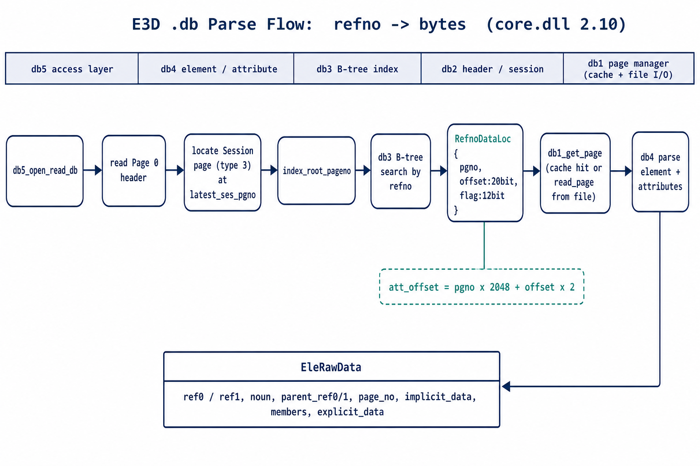
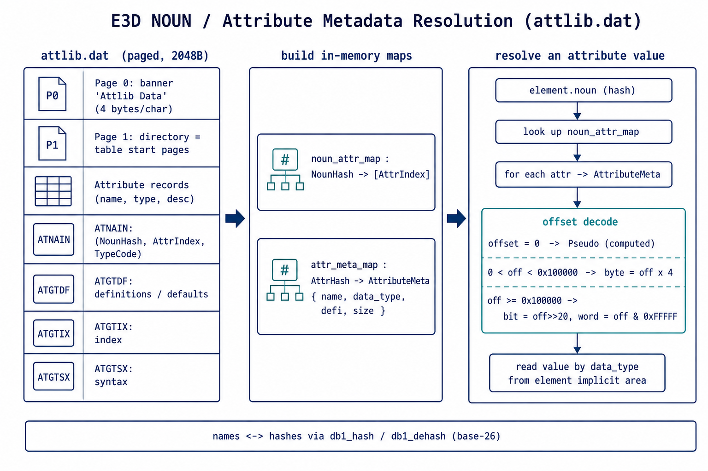

# AVEVA E3D / PDMS 数据库解析指导（db1–db5）

> 基线:**AVEVA Everything3D 2.10** `core.dll`（实时 IDA 核验，镜像基址 `0x10000000`）。
> 配套《E3D_DB_文件格式规范.md》给出**磁盘格式**；本文给出**如何解析**——既讲 core.dll 内部 db1–db5 的解析机制，也给出**不依赖 core.dll 的独立解析算法**。
> 标注同规范:**[IDA]** = 2.10 反编译确认，**[实测]** = 样本验证。

---

## 1. 五层架构总览

E3D 数据库引擎在 core.dll 中分为五层，自顶向下:

| 层 | 职责 | 解析阶段角色 |
| :--- | :--- | :--- |
| **db5** 访问层 | 打开/关闭/保存/刷新/压缩、会话与 extract、多写合并 | 入口:`db5_open_read_db` |
| **db4** 元素/属性层 | 元素 CRUD、当前元素(CE)栈、属性读写、引用 | 解析元素与属性 |
| **db3** B-树索引层 | refno→位置 的 B-树检索、表遍历、节点分裂 | refno 定位 |
| **db2** 头部/会话层 | 读 Page0 头部、会话状态、Page0/会话属性、桶、Extract | 定位会话与索引根 |
| **db1** 页管理层 | 物理页读写、内存页缓存(PLU)、页锁、令牌、文件 I/O | 取页字节 |



> 关键事实:每个 db 函数在调试模式下会用 `dword_10F68F58(.., "<函数名>", ..)` 记录自身名，并带 `模块.节.序号` 版本码(如 `1.2.1`=db1_get_page、`4.6.1a`=db4_get_ce_att)。这为在任意构建里**用字符串重定位函数**提供了可靠锚点——这正是本项目核验 2.10 地址的方法。[IDA]

---

## 2. db1 — 页管理层(取字节)

把 `(dbno, pgno, extno)` 解析为内存中的页数据指针，对上层屏蔽磁盘与缓存细节。

**核心调度 `db1_get_page` `0x10634DC0` (1.2.1)** [IDA]
```
db1_get_page(token[dbno,pgno,extno], lock_flag, prefetch_count, out_ptr)
  → 查缓存命中? (db1_is_page_incore)
      命中  → lock_count++ , 返回页内存指针 ("page %d (type %d) already in core")
      未命中→ 分配槽位(PLU/LRU) → db1_read_page 读盘 ("Just reading page %d ...")
              → (可选)多页预读 / 本地文件缓存 → 返回指针
```

| 函数 | 地址(2.10) | 作用 |
| :--- | :--- | :--- |
| `db1_get_page` | `0x10634DC0` | 逻辑取页(缓存命中/未命中调度) |
| `db1_read_page` | `0x10630C20` | 物理读盘(经 FHDBRN→DirectAccessToken) |
| `db1_write_page` | `0x10633FB0` | 物理写盘(临时/正式双路径) |
| `db1_update_page` | `0x10635E30` | 事务更新(COW，置 dirty) |
| `db1_get_new_page` | `0x10635B00` | 物理页分配 |
| `db1_init` | `0x106339F0` | 初始化缓存池/哈希(用质数定哈希表大小) |

**页大小**:db1 全局用「每页字数」存放，字节数 = 字数 × 4。对 E3D 2.10 实测恒为 **2048 字节**（见格式规范 §1.1，并已纠正旧工具按 512 字节的误读）。[实测]

---

## 3. db2 — 头部/会话层(定位)

负责读 Page0 头部、维护会话链、读 Page0/会话级属性、桶与 Extract。

- `db2_read_page` `0x10628EC0`:在 db1 取页基础上做**页类型校验**(错误串如 `"2GTP0RAA:Page read is not of correct type. Page should be type ..."`)。[IDA]
- `db2_modify_header_page` `0x10620F60` (2.0.5):读写 Page0 头部。[IDA]
- `db2_get_session_pgid` `0x10621480` (2.1.0):取当前会话页 ID。[IDA]
- `db2_get_db_int_att` `0x10622F20` (2.2.1a):读数据库级整型属性(`"Attribute name is %s"`)。[IDA]

**解析用途**:从 Page0 头部取 `latest_ses_pgno` → 定位会话页(type 3) → 读出 `index_root_pageno`(B-树根)与 `claim_pageno`。会话页结构见格式规范 §4。

---

## 4. db3 — B-树索引层(refno 定位)

把 64 位 `refno` 映射到元素数据的物理位置 `RefnoDataLoc{pgno, offset, flag}`。

| 函数 | 地址(2.10) | 作用 |
| :--- | :--- | :--- |
| `db3_get_table_entry` | `0x1061E9F0` (3.3.2) | 按键从索引表取值 |
| `db3_start_table_search` | `0x1061EC50` (3.3.3) | 启动表迭代(校验 `"Page is not a table page (page is type %d)"`) |
| `db3_get_next_table_entry` | `0x1061F110` | 迭代下一条 |
| `db3_scan_index_page` | `0x1061CF20` (3.3.7) | 扫描索引页 |
| `db3_get_page_entry` | `0x1061AF30` (3.2.1) | 索引页内查键 |

**定位公式**(与 Rust `RefnoDataLoc::get_att_offset` 一致):
```
att_byte_offset = pgno × page_size + offset × 2     // offset 为 20 位，以 2 字节为单位
```
索引数据页 `IndexPageData.noun` 恒为 `0xCC47DF`(可用作页面识别断言)。[实测/defines.rs]

---

## 5. db4 — 元素/属性层(解析数据)

把页字节解析为元素与属性。

**元素**:`db4_create_element` `0x1060CCA0` (4.1.4)。元素记录磁盘结构见格式规范 §6(`EleRawData`:refno、noun、parent_ref、page_no、隐式/显式数据、成员)。

**元素类型(noun)字段解码**(`parse.rs:460-462`,已实测):元素记录 `+0x0C` 的 `type_hash` 就是 **base-27 db1_hash**(算法见格式规范 §7.5):
```
type_hash = u32_be(input[12..16])          # 例:ele_data_0 = 0x97247
noun_name = db1_dehash(type_hash)          # "WELD"  (标准 noun ✓)
attrs     = noun_attr_info_map[type_hash]  # 以 type_hash 作为元数据表 key 取属性集合
```
> **纠错**:`noun_hash_table.json` 用了错误的 base-26 公式(PIPE=0x463E9);正确 db1_hash 为 **base-27 + 0x81BF1**,PIPE=`0x9CAF3`。core.dll 侧 `db4_get_att_dets` 也是把类型 code 经 `sub_10630990`(dehash)还原为类型名。[IDA]

**属性读取链**(核心)[IDA]:
```
db4_get_ce_att (0x10612A50, 4.6.1a)
  1. att_code 先减常量 531442，再做范围校验 (<= 0x17179147)
  2. 调 db4_get_att_dets(0x10611FF0, 4.5.1) 取描述符:
        在“元素类型定义表”里线性查找:步进 desc += *(desc+0x3C)，匹配 *(desc+0x38)==att_code
        命中描述符关键字段: +0x08 = 类型索引, +0x0C = 大小
  3. 按类型读值:类型索引用于定点↔浮点缩放表 dbl_10F68E90[type]
        日志: "4GCEA:Attribute name is %s, attribute offset is %d" / "Actual type is %s"
```

属性取值的 C API 族(按类型分派):`db_get_integer` / `db_get_real` / `db_get_string` / `db_get_logical` / `db_get_reference`，以及数组与表属性 `db_get_int_array` / `db_get_ref_array` / 表属性。NOUN(元素类型)→属性集合 的元数据由运行时字典维护,详见 `DB_Noun属性元数据获取机制.md` 与 `NOUN属性元数据完整指南.md`。

---

## 6. db5 — 访问层(入口)

| 函数 | 地址(2.10) | 作用 |
| :--- | :--- | :--- |
| `db5_open_read_db` | `0x105E4940` (5.1.7) | 只读打开数据库(解析入口) |
| `db5_close_db` | `0x105E4D60` (5.1.9) | 关闭 |
| `db5_save_work` | `0x105E9C80` (5.4.4) | 持久化(校验 `"Page is not a session page"`) |
| `db5_refresh_work` | — | 拉取其他用户最新修改 |

打开后即可经 db2→db3→db4 完成"会话→索引→元素/属性"的解析。

---

## 7. 端到端解析算法(独立实现，不依赖 core.dll)

下述算法可用纯文件读取实现(Rust `pdms_io` 即如此)。两种枚举策略可二选一或互补。

```text
# 步骤 0:读头部
buf = read(file)
hdr = parse_big_endian(buf[0..0x40], PdmsHeader)
PAGE = (u32_be @ 0x34) * 4            # = 2048（关键:字数×4，勿当字节）

# 步骤 1:定位最新会话页
ses = parse(buf[hdr.latest_ses_pgno*PAGE ..], SessionPageData)   # page_type 必为 3
index_root = ses.index_root_pageno

# 步骤 2A（索引驱动，精确）:从 index_root 遍历 B-树
for leaf in walk_btree(buf, index_root, PAGE):                   # IndexPageData.noun==0xCC47DF
    for loc in leaf.refno_locs:                                  # RefnoDataLoc，遇 u32==0 终止
        att_off = loc.pgno*PAGE + loc.offset*2
        record  = parse_element_at(buf, att_off)                 # EleRawData

# 步骤 2B（扫描驱动，简单）:直接扫元素页
for pg in 0 .. (len(buf)/PAGE):
    head = u32_be @ pg*PAGE
    if head == 7 or head in DATA_PAGE_MAGICS:                    # 元素/数据页
        page = parse(buf[pg*PAGE ..], ElePageData)               # flag + EleRawData[]，遇 u32==0 终止
        for ele in page.eles_vec: emit(ele)

# 步骤 3:解析每个元素的属性
for ele in elements:
    noun = ele.noun
    descs = attribute_descriptors_of(noun)        # 由 noun 元数据字典给出 (code,type,size,offset)
    decode(ele.implicit_data, descs.implicit)     # 隐式段
    if ele.explicit_data: decode(ele.explicit_data, descs.explicit)
```

要点:
- **全程大端**;长度字段多为"字"(×4 得字节);refno 为 `(u32,u32)`。
- `RefnoDataLoc.offset` 是 20 位、以 2 字节为单位;`flag` 12 位。
- 跨页的成员列表/属性数据需要拼接(现有 Rust 实现标注为 TODO，见格式规范 §8)。

---

## 8. Rust 参考实现对应（`pdms_io`）

| 概念 | core.dll(db 层) | Rust(`src/`) |
| :--- | :--- | :--- |
| 头部 | Page0 / db2_modify_header_page | `defines::PdmsHeader` |
| 会话页 | type 3 / db2 会话 | `defines::SessionPageData` / `SesIndexesData` |
| B-树索引 | db3 | `defines::IndexPageData` / `RefnoDataLoc` / `RootIndexPage` |
| 元素页 | type 7 / db4 | `defines::ElePageData` / `EleRawData` / `EleMembers` |
| 页缓存 | db1 PLU | `io.rs` PageManager(HashMap 缓存 + LRU) |
| refno 定位 | db3 | `io.rs` B+tree 搜索 + `RefnoDataLoc::get_att_offset` |

> ⚠️ 需修正:`defines::detect_page_size` 目前把 `header.page_size`(=512)当字节，应改为 `×4`(=2048)。见格式规范 §8 #1。

---

## 9. 在 IDA 里复核/继续分析的技巧

1. **用自标识字符串定位函数**(跨版本可靠):搜索字符串 `db1_get_page`/`db4_get_ce_att`/…，取其 `DataRefsTo` 的所属函数即真身。本项目据此确认 2.10 地址，并发现 `core_dll_数据库读写函数.md`(401 函数表)属另一构建、地址不匹配。[IDA]
2. **用 `模块.节.序号` 版本码**(如 `2.2.1a`)交叉确认函数归属层与用途。
3. **页类型校验串**(如 `"Page should be type 1"`、`"Page is not a session page"`)能直接揭示某函数期望的页类型。
4. **样本驱动**:用 `pdms-test-data/sam7200_0001`(头部)、`ele_data_0`(单个 2048B 元素页)、`att_data_0`(属性数据)做十六进制对照。
5. 反编译可用 ida-pro-mcp 的 `analyze_function`(伪代码+字符串+调用关系)或 `py_eval` 跑 IDAPython。

---

## 10. 函数地址速查表（E3D 2.10，base 0x10000000）

| 层 | 函数 | 地址 | 版本码 |
| :--- | :--- | :--- | :--- |
| db1 | get_page / read_page / write_page / update_page / get_new_page / init | 0x10634DC0 / 0x10630C20 / 0x10633FB0 / 0x10635E30 / 0x10635B00 / 0x106339F0 | 1.2.x |
| db2 | read_page / modify_header_page / get_session_pgid / get_db_int_att / init | 0x10628EC0 / 0x10620F60 / 0x10621480 / 0x10622F20 / 0x10621EE0 | 2.x |
| db3 | get_page_entry / scan_index_page / get_table_entry / start_table_search | 0x1061AF30 / 0x1061CF20 / 0x1061E9F0 / 0x1061EC50 | 3.x |
| db4 | create_element / get_ce_att / get_att_dets / get_list | 0x1060CCA0 / 0x10612A50 / 0x10611FF0 / 0x1060CE20 | 4.x |
| db5 | open_read_db / close_db / save_work | 0x105E4940 / 0x105E4D60 / 0x105E9C80 | 5.x |

> 完整函数清单见 `db1_页面管理器分析总结.md` 与 `db2_db5_驱动层分析总结.md`(以"E3D 2.x"列为准)。

---

## 11. NOUN / 属性元数据解析（noun → 属性 → 类型 → 值）

元素记录里只有 `noun_hash` 和裸属性数据;要知道"某 noun 有哪些属性、各自类型/偏移"，需要 **noun 元数据**。它有两条获取路径，结果应一致。



### 11.1 运行时路径（core.dll）
- `DB_Noun::dictionary_`(`std::map<hash, DB_Noun*>`，约 1931 条)在打开库时建立。
- `DB_Noun::getSystemAttributes`(2.10 `0x107694AD`)→ `db_get_attribute_list`(opcode 60，`0x1093DD60`)→ `sub_10993900`(`0x10993900`)从 attlib 内存缓存取 ATNAIN。
- `DB_Attribute::findAttribute`(`0x1075FB35`)按 hash 懒加载属性定义。
- 取值 5 层链(详见《Element 属性二进制读取反序列化全链路》，其地址多为 3.1，2.10 等价):
  - **L1** `DB_PseudoAttPlugger::get*Att`(类型化入口)
  - **L2** BST 值缓存 + Handler 虚分发(三级类型回退:`actualType → contentType → hardType → NOUN_UNKNOWN`)
  - **L3** `DB_Element::internalGetAtt`(2.10 `0x107CEA1E`)决策树(UDA / Pseudo / 分布式属性分流)
  - **L4** `dabGetAtt`(`0x107BC6A8`)+ `elGotoCPP`(`0x107C1723`)游标定位
  - **L5** 记录级二进制读取(按存储类型反序列化)

### 11.2 离线路径（独立解析，推荐）
解析 `attlib.dat`(见格式规范 §7.4)构建两张表:
- `noun_attr_map: NounHash → [AttrIndex]`(来自 ATNAIN)
- `attr_meta_map: AttrHash → AttributeMeta{ name, data_type, defi, size, ... }`(来自属性记录 + ATGTDF)

随后:
```
schema = noun_attr_map[ db1_hash(noun_name) ]      # 该 noun 的属性集合
for attr in schema:
    meta = attr_meta_map[attr.hash]
    if meta.defi == Pseudo: continue               # 计算/显式块，不在隐式区
    pos  = decode_offset(meta.offset)              # 见格式规范 §7.2
    val  = read_by_type(implicit_area, pos, meta.data_type)   # 见格式规范 §7.1
```
Rust 实现:`crates/parse_pdms_db/src/parser/attlib/`(`AttlibData::parse_attlib_file` / `NounSchema::from_attlib`)。

### 11.3 提醒
- noun/属性名 ↔ hash 用 `db1_hash` / `db1_dehash`(**base-27 + 0x81BF1**,见格式规范 §7.5)互转。
- 属性分布在隐式区(DAB)与显式块/伪属性，需结合格式规范 §7.2、§7.3。
- 离线扁平映射不含 core.dll 的三级类型回退;遇 UDET/UDA 需另行处理。

### 11.4 attlib 真实访问机制（IDA 实测，纠正"逐页三元组"假设）

core.dll 经 **`DB_Noun::internalGetField`(`sub_1084F7C0`)** 在 attlib 表 `ATNAIN` / `ATNATX` / `ATNALO` 上查 (noun, attr) → **位移(offset)**。它**不是**简单的"逐页 `[attr, noun, offset]` 三元组",而是**多级哈希索引 + 2D 矩阵**:

1. `noun_hash → noun 索引 v21`:哈希表 `unk_11C12080`(查找 `sub_10450144`),并校验 `dword_11C12210[v21-1]==8`(否则错误 52)。
2. `attr_hash → attr 索引 v24`:哈希表 `unk_11BFA080`(查找 `sub_104501F8`)。
3. `attr 索引 → 两列`:`dword_11C02080[v24-1]`(列A) 与 `dword_11C02080[v24-1+0x2000]`(列B,记录位移基)。
4. `(列A=record, noun_hash) → 缓存槽 v27`(`sub_1044FC20`=`ATRDRC`,把文件页 colA 读入缓存槽 v27;见下方精确语义)。
5. `位移 = dword_11C2A860[512*v27 + 列B + v21 - 514]` —— 即**文件页 colA 的第 `(列B + v21 − 2)` 字**(`dword_11C2A860` 是 512 字/页的页缓存);若为 0 改查 `ATNATX` 列。
   - 错误码:63=字段越界、51=noun 越界/无效、54=attr 未找到、56=查表失败、55=无位移。

辅助表 `ATGTIX`(Attribute/Noun Index)的列布局为「Hash code + word | Record | Displacement」(见调试转储 `sub_1085375C`)。

**attlib 文件段记录格式(加载器 `sub_10852A64`,经 `FHDBRN` 逐页读取):**
- `ATGTIX`(属性索引):每条 **2 个 word `[attr_hash, combined]`**;`record = combined / 512`、`displacement = combined % 512`。有效 `attr_hash ∈ [531442, 387951929]`;`0`=翻页、`-1`=段尾。(与 rs-core `AttlibAttrIndex{ attr_hash, combined }` 完全一致。)
- 属性侧有并行查找 **`DB_Attribute::internalGetField`(`sub_10850888`)**,用表 `ATAAIN`/`AXAATX`/`ATAALO`,与 noun 侧**共享同一 2D 矩阵 `dword_11C2A860`**。
- 运行时表由编排器 **`sub_10851210`** 从各段构建(读 `ATGTIX` → 填充哈希表 `unk_11BFA080`、列表 `dword_11C2A850/854` 等)。

**加载器 `sub_10851210` = `ATTOPE`(打开属性文件)**:用 `FHFIND(..., "OLD, READ", ..., &dword_11E1E860)` 经 Fortran 文件系统打开 attlib 得文件 token,再调 ATGTIX/ATGTDF/ATGTSX 各段加载器。

**辅助函数精确语义(已逆清):**
- `sub_10450144` = **`ATFIND`**:数组**线性查找**,返回元素的 **1-based 索引**(未找到返回 0)。noun_hash → noun 索引、attr_hash → attr 索引都走它。
- `sub_1044FC20` = **`ATRDRC`**:attlib 的 **LRU 页缓存读取器**(1000 槽 × 512 字)。`FHDBRN(&token, &page_no, &dword_11C2A860[512*slot-512], …)` 把**文件页 `page_no`** 读入某缓存槽,**返回的 `v27` 是槽号,不是文件页号**;要读的**文件页号 = colA = v25**(即 attr 的 ATGTIX `record` 列)。

**因此 §11.4 步骤 5 的精确含义(更正先前"页=v27-1"的说法):**

> **offset = attlib文件页[ record(attr) ][ disp(attr) + noun_index − 2 ]**
>
> - `record = ATGTIX.combined / 512`(= colA = 文件页号)
> - `disp = ATGTIX.combined % 512`(= colB = 页内字基)
> - `noun_index = ATFIND(noun_hash)` 的 1-based 位置(= 列偏移 v21)

即:**给定 attr 决定"哪一文件页 + 列基",给定 noun 决定"列号",二者相加定位到 attlib 文件页中的那个 offset 值。**

> **离线复刻状态(诚实记录)**:查表机制、3 个辅助(`ATFIND`/`ATRDRC`)、`internalGetField` 公式结构均已逆清(见上)。文件坐标也已定位:POS(0x853B1)的 ATGTIX 条目 `combined=0x83787` → `record=1051, disp=391`;noun 表位于 ~file_page 2235(WELD/PIPE 均在此)。
> **但经验闭环尚未完成**:① `internalGetField` 含跨页**链式回退**(`i = dword_11C2A860[…]` 回填后继续),上面的单步公式只是"无冲突直读"情形;② noun 表在文件中是**交错布局**(非平铺哈希数组),WELD 的 noun_index 未能简单确定。探针(读 block 1051 的 POS 行)未直接读出实测 `offset` 对应 WELD-POS@word13。
> ⇒ 完整可用的离线读取器需**忠实实现链式查找 + 正确的 noun 表索引提取**,属仍待收尾的聚焦实现(机制已备,差精确编码与闭环验证)。

> **结论**:仓库内启发式脚本(逐页三元组、段[2]"2 字一条"noun 表)与真实布局**不符**——这解释了为何离线解析对不上、且项目依赖预生成 config。要可靠拿命名属性的物理 offset,应按上述多级索引复刻 attlib,或直接走 core.dll 运行时(`db_get_attribute_list` opcode 60 → `DB_Noun::internalGetField`)。

---

## 12. 写入 / 保存路径（`db5_save_work`，2.10 实测）

写操作采用 **写时复制(COW) + 会话(session)** 模型:修改先在内存/临时页累积为 dirty,`db_save_work` 时统一刷盘,并把 page0 指向**新会话页**(旧会话经 `last_ses_pgno` 链保留,支持 mark/rewind)。

入口 **`db5_save_work`(`0x105E9C80`,版本码 5.4.4)**。主流程(callee 均经自标识调试字符串确认):

| 阶段 | 关键函数(2.10) | 作用 |
| :-- | :-- | :-- |
| 校验 | (内部) | 无写模式库则报错 `5SW:No dbs open in write mode` |
| 进入直写模式 | `db1_set_update_db_direct`(1.4.6,0x10632CF0)、`db1_init_temp_pages`(1.4.1,0x10631E10)、`db1_switch_mode`(1.4.4,0x10632570) | 切到"直接更新 DB"模式并初始化临时页 |
| 新建会话 | `db2_get_session_int_att`(2.3.2a,0x10626460)、`db2_get_next_fileid`(2.2.7,0x10625050) | 生成新会话;校验 `5SW:Sesno pointed to by page0 is %d,but sesno being created is %d` |
| 元素页整理 | `db4_init_element_page`(4.1.2,0x1060C950)、`db4_get_nep_info`(4.1.3,0x1060CA30)、`db4_remove_refs_on_temp_pages`(4.3.4,0x1060EA10) | 整理元素页、清理临时页引用 |
| **批量写盘** | **`db1_write_update_db_pages`(1.4.9,0x106365F0) → `db1_write_page`(1.1.4,0x10633FB0)** | 把 dirty 页批量写入磁盘 |
| 更新头部 | `db2_modify_header_page`(2.0.5,0x10620F60)、`db2_update_page1_userid_or_ref`(2.5.1,0x1062A220) | page0/page1 指向新 `latest_ses_pgno`、更新用户/引用 |
| 收尾 | `db1_unset_update_db_direct`(1.4.7,0x10636810)、`db1_return_last_page`(1.4.8,0x10633070)、`db2_remove_all_but_newest_roots`(2.2.10,0x10625610) | 退出直写模式、回收、整理索引根 |

底层写原语:
- **`db1_update_page`(1.2.4,0x10635E30)= COW**:多用户模式校验 dbno → 分配临时页 + 拷贝 + 交换 → 置 dirty 标志(`0x4000`)。
- **`db1_write_page`(1.1.4,0x10633FB0)= 物理写**:临时文件 vs 正式 DB 双路径;正式写支持 **32 页批量缓冲**后落盘(经 FHDBWN → DirectAccessToken)。

> 读写对称:**读** = page0 → 会话页 → B 树 → 页 → 元素;**写** = 改(COW 置 dirty)→ `save_work`(批量刷 dirty 页 + 建新会话 + page0 重指向)。会话链 `last_ses_pgno` 使历史可回溯(mark/rewind/refresh)。

---

## 13. B-树写侧（索引插入 / 分裂，db3）

索引页(type 5, `noun=0xCC47DF`)的写入维护由 db3 完成(2.10 实测):

- **`db3_insert_page_entry`(3.2.4,0x1061B5C0)**:向索引页插入键/值。
  - 索引页描述符 **`word[6]` = 剩余空闲字数**;插入前算所需空间 `need`。
  - 若 `free(word[6]) ≥ need`:**右移**已有条目腾位 → 写入新 key/值 → `word[6] -= need`。
  - 若不足:置 **溢出标志**(`*overflow = 1`),交上层分裂。
- **`db3_split_node`(3.2.6,0x1061BA50)**:页满时分裂。
  - `db1_get_new_page`(0x10635B00)分配新索引页 → 条目在新旧页间**再分布** → 向父层**上抛分隔键**。
  - 校验表名/层级(错误串 `3SN:Expected table page of level %d, but got level %d`、`3SN:Page is not a table page` 等)。
- **`db3_split_root`(0x1061C340)**:根页分裂 → 新建根、原根降为子层,**增加树高**(同时调用 insert/split)。
- 配套:`db3_update_page_entry`(0x1061B4B0)改条目、`db3_remove_level_0_page_entry` 删条目。

写入链:db4 建/删元素 → 维护 refno 索引 → `db3_insert_page_entry` →(满)`db3_split_node`/`db3_split_root` → `db1_get_new_page`/`db1_update_page`(COW)→ 落盘见 §12。

> 读侧(§4–5)沿 B-树下行查 refno;写侧即其逆:插入/分裂维护同一 `RefnoDataLoc` 索引结构。

---

## 14. 维护操作：压缩 / 刷新 / 多写（db5）

建立在 §12 写路径 + 会话机制之上的数据库**生命周期/协作**操作(2.10 实测):

- **`db5_compact`(5.4.6,0x105EA8B0)**:压缩数据库、回收死页/碎片。
  - 用一个**压缩目标 dbno**(`dbno + 0x3FFFF`)经 `db1_get_new_page`(0x10635B00)分配全新页,把**存活元素深拷贝**(`db4_copy_user_element`,0x1060D820)到紧凑新布局并丢弃无用页;期间用 `malloc/realloc` 临时缓冲。
  - 处理 primary session list 与 extract 树(配套 `db5_compact_leaf`/`db5_compact_ext_tree`)。诊断串 `5C:intref is %d/%d, extno is %d, rootextno is %d`。
- **`db5_refresh_work`(5.4.7,0x105E8000)**:刷新工作区,拉取其它用户/会话的最新已提交变更。
  - 枚举会话(内部迭代器)→ 比较会话号 → 重载相关页(`db1_get_page` 0x10634DC0)、清理临时页引用(`db4_remove_refs_on_temp_pages` 0x1060EA10)。
- **`db5_suspend_db`(5.4.8,0x105E85A0)**:挂起数据库写入。
- **多写/Extract 协作**:claim/release、`flush`/`refresh`(master ↔ extract 同步)、multiwrite merge —— 在多用户共享库下协调元素归属与合并(详见两份 summary 文档的 db5 表)。

> 关系:`save_work`(§12)每次产生**新会话**;`compact` 重写紧凑库;`refresh` 拉取新会话;`flush/refresh` 在 master 与 extract 间同步。会话链(`last_ses_pgno`)+ mark 提供历史回溯。

---

*生成于 AVEVA E3D 2.10 core.dll 实时逆向 + 真实样本核验。配套文档:《E3D_DB_文件格式规范.md》。*
