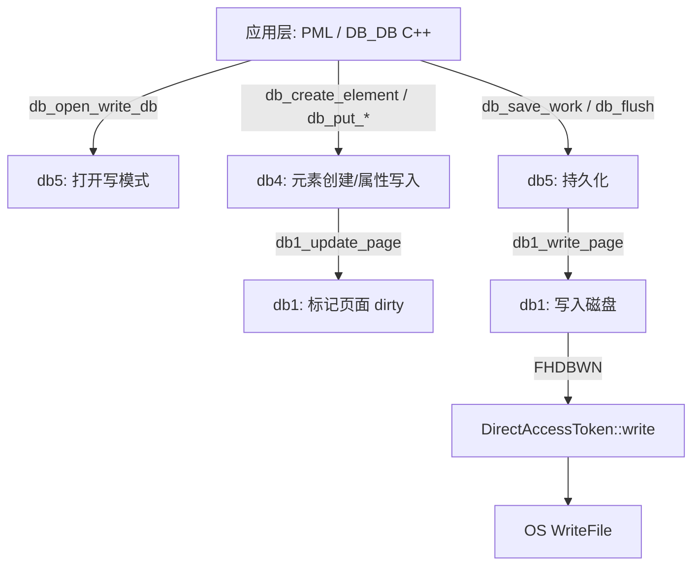
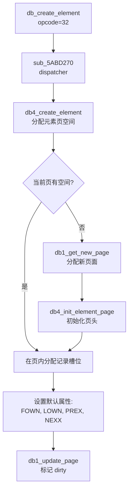
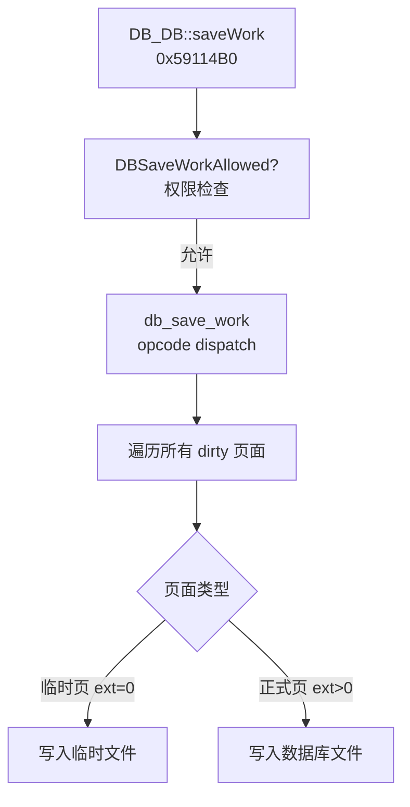
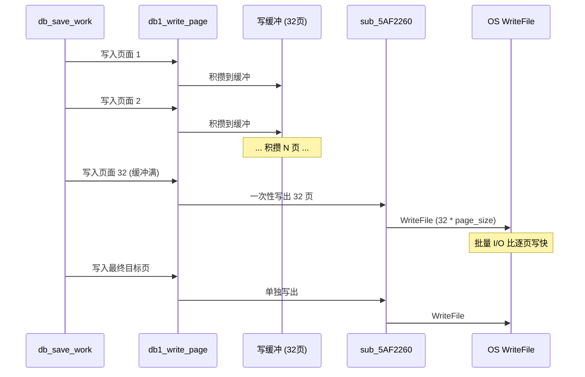
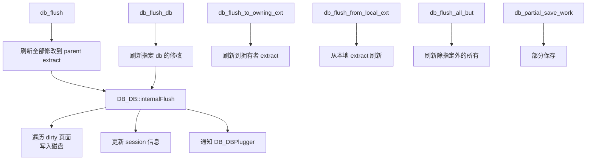
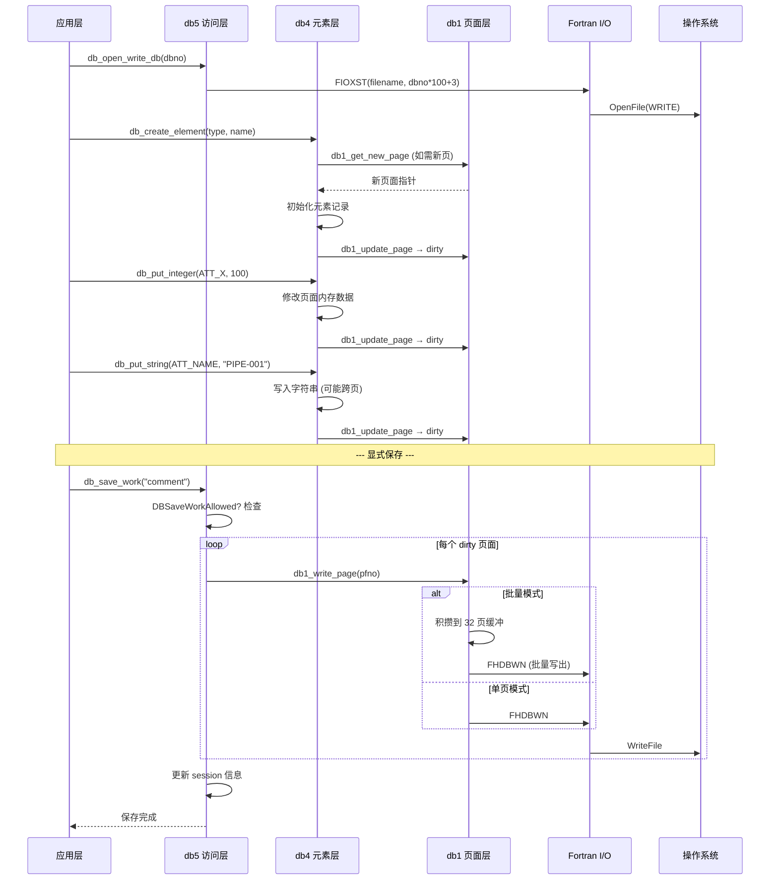

# E3D/PDMS 数据库写入架构（E3D 3.1）

> 基于 core.dll 逆向分析 + pdms-io-fork Rust 实现对照

## 1. 总览



## 2. 阶段一：打开写模式

### 2.1 调用链

```
DB_DB::openWrite()                             // 0x590C9B0
  → DB_DB::checkWrite()                        // 权限检查
  → DB_DB::openFile(mode=3)                    // mode=3 → FILEWRITE
    → FIOXST(filename, dbno*100+3, ...)
    → openMode = "FILEWRITE"
```

### 2.2 创建新数据库

```
DB_DB::createBasic(session_flag)               // 0x58FA860
  → DB_SchemaMngr::openSchema()                // 打开 Schema 定义
  → FIONEW(filename, dbno*100+3, ...)           // 创建新文件
  → db_create_master_db(                        // 初始化主数据库结构
      area, file_handle, session,
      dab_type, ...)                            // opcode=34, impl sub_5AF46F0
  → DB_DB::closeFile()
  → DB_DB::openWrite() / DB_DB::openNosave()
```

---

## 3. 阶段二：元素创建与属性修改

### 3.1 创建新元素



### 3.2 写入属性

```
db_put_integer(attr_id, value)                 // opcode=144, sub_5AD28D0
  → 定位 CE 当前页面的属性偏移
  → 直接修改内存页面中的值
  → db1_update_page: 标记页面 dirty

db_put_string(attr_id, str, qualifier, len)
  → 定位属性偏移
  → 若字符串超出当前记录空间:
    → 分配续页 (type=7)
    → 写入续页数据
  → db1_update_page

db_put_reference(attr_id, ref_element)
  → 写入引用值
  → db1_update_page

db_put_int_array(attr_id, array_data)
  → 写入数组数据
  → 可能需要多页
  → db1_update_page
```

---

## 4. 阶段三：db1_update_page — 事务页面管理

### 4.1 核心流程 (0x5AF1600)

```mermaid
flowchart TD
    START[db1_update_page<br/>0x5AF1600<br/>输入: pfno, out_changed, out_pgid] --> MULTIUSER{多用户模式?<br/>dword_6A5411C}
    
    MULTIUSER -->|是| CHECKDB{页面属于<br/>当前 db?}
    CHECKDB -->|否| ERROR654[error 654<br/>一致性错误]
    CHECKDB -->|是| CHECKEXT{当前 session<br/>& extent 匹配?}
    CHECKEXT -->|匹配| MARKDIRTY
    CHECKEXT -->|不匹配| COW
    
    MULTIUSER -->|否| CHECKDIRTY{已经是<br/>dirty?}
    CHECKDIRTY -->|是| MARKDIRTY[设置 flags |= 0x4000<br/>返回 page_id]
    CHECKDIRTY -->|否| COW
    
    COW[Copy-on-Write] --> NEWSLOT[sub_5AEF150<br/>分配新页面槽位]
    NEWSLOT --> COPYDATA[复制旧页数据到新页]
    COPYDATA --> SWAP[交换新旧页面的<br/>page_id 和引用]
    SWAP --> SETFLAGS[新页: flags |= 0x4000 dirty<br/>新页: flags |= 0x10000 locked]
    SETFLAGS --> MARKDIRTY
```

### 4.2 页面标志位操作

| 操作 | 标志位 | 含义 |
| :--- | :--- | :--- |
| `flags \|= 0x4000` | bit 14 | 标记 dirty (已修改) |
| `flags \|= 0x10000` | bit 16 | 标记 locked (防止换出) |
| `flags & 0x3FFF` | bit 0-13 | lock_count |
| `flags \|= 0x8000` | bit 15 | 标记 prefetched |

---

## 5. 阶段四：持久化（Save Work / Flush）

### 5.1 db_save_work 调用链



### 5.2 db1_write_page — 磁盘写入 (0x5AF1C30)

```mermaid
flowchart TD
    START[db1_write_page<br/>0x5AF1C30] --> CHECK{extent == 0?<br/>临时页?}
    
    CHECK -->|临时页| TEMP[写入临时文件路径]
    TEMP --> FILLGAPS{page_no ><br/>temp_file_size?}
    FILLGAPS -->|是| DUMMIES[填充中间空洞页<br/>写入 dummy 数据]
    FILLGAPS -->|否| SKIP
    DUMMIES --> WRITETEMP
    SKIP --> WRITETEMP[sub_5AF2260<br/>写入当前页]
    WRITETEMP --> UPDATETSIZE[更新 dword_6A54144<br/>temp_file_size]
    
    CHECK -->|正式页| VALIDATE{dbno & extent<br/>匹配当前 session?}
    VALIDATE -->|不匹配| ERROR506[error 503/506]
    VALIDATE -->|匹配| BATCH{批量写启用?<br/>dword_6A54160}
    
    BATCH -->|启用| BUFFER[积攒到 dword_6A54158<br/>缓冲区 (最多32页)]
    BUFFER --> FULLCHECK{缓冲满 或<br/>到达目标页?}
    FULLCHECK -->|满| FLUSHBATCH[sub_5AF2260<br/>批量写出 N 页]
    FULLCHECK -->|未满| NEXTPAGE[继续下一页]
    FLUSHBATCH --> NEXTPAGE
    
    BATCH -->|未启用| SINGLEWRITE[逐页写出<br/>sub_5AF2260]
    
    NEXTPAGE --> DONE{所有页面<br/>写完?}
    DONE -->|否| BUFFER
    DONE -->|是| WRITESELF[写入当前页自身]
    WRITESELF --> UPDATESIZE[更新 dword_6A54120<br/>file_size]
    
    SINGLEWRITE --> UPDATESIZE
```

### 5.3 sub_5AF2260 — 底层写入

```
sub_5AF2260(token, block_no, data, word_count, flags)
  → FHDBWN(token, block_no, data, word_count)
    → DirectAccessToken::write(page_no, data, size, 1)
      → OS WriteFile(offset = page_no * page_size, data, size)
```

### 5.4 批量写入优化

E3D 3.1 通过 `dword_6A54160` 标志启用批量写入：



---

## 6. 阶段五：Flush（提取刷新）

### 6.1 Flush 操作层次



### 6.2 Flush 与 Save Work 的区别

| 操作 | 作用 | 事务语义 |
| :--- | :--- | :--- |
| `db_save_work` | 将当前 session 所有修改持久化到磁盘 | 创建新 session 快照 |
| `db_flush` | 将本地 extract 的修改推送到 parent extract | 跨 extract 合并 |
| `db_partial_save_work` | 仅保存部分修改 | 增量快照 |
| `db_refresh_db` | 重新加载其他用户的最新修改 | 刷新缓存 |

---

## 7. 错误处理与回滚

### 7.1 写入错误处理

```
db1_write_page 失败时:
  → FHQERC: 获取 Fortran 层错误字符串
  → 格式化错误消息: "1WP:Name=%.256s, Dbno=%d, pgid=%d %d, Token=%d, Error=%.64s"
  → 设置 dword_6453B98 = 37 (写入错误)
  → 返回 0
```

### 7.2 Flush 失败回滚

```
db_undo_failed_flush
  → 撤销失败的 flush 操作
  → 恢复到 flush 前的状态

db_register_failed_flush
  → 记录失败的 flush 到待处理列表
  → 后续可重试或手动处理
```

---

## 8. 写入流程端到端时序



## 9. 与 pdms-io-fork 的对应

| 写入阶段 | core.dll 函数 | pdms-io-fork (Rust) |
| :--- | :--- | :--- |
| 打开写模式 | `FIOXST(mode=3)` | `File::create` / `OpenOptions::write` |
| 创建新文件 | `FIONEW` + `db_create_master_db` | `writer.rs` 中的初始化逻辑 |
| 标记 dirty | `db1_update_page` (0x4000) | `PageManager::mark_dirty` |
| 锁定页面 | `db1_lock_page` (+lock_count) | `PageManager::lock_page` |
| 页面写入 | `db1_write_page` → `FHDBWN` | `PageManager::write_page` → `write_page_to_file` |
| 批量写入 | 32 页缓冲 `dword_6A54158` | — (Rust 未实现) |
| 刷新脏页 | `db5_save_work` 遍历 | `PageManager::flush_dirty_pages` |
| 元素创建 | `db4_create_element` | `ElementSerializer` |
| 属性写入 | `db_put_*` 系列 | `writer.rs` `element_writer` |
| 会话页写入 | `db2_modify_header_page` | `SessionPageData` 结构 |
