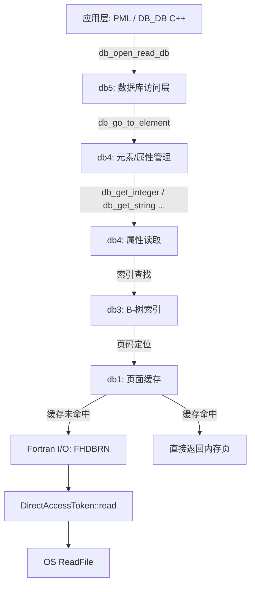
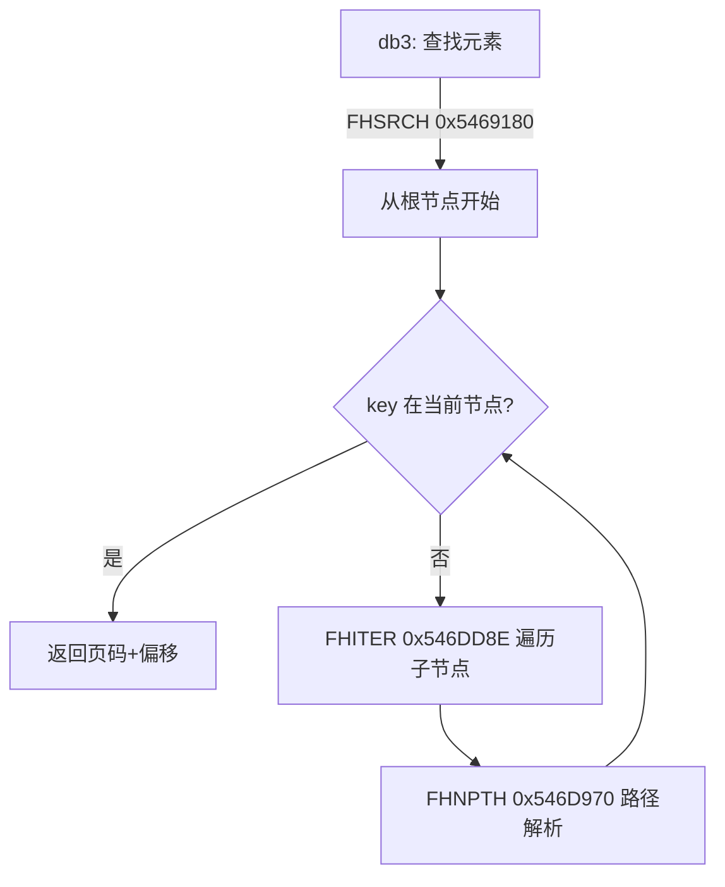
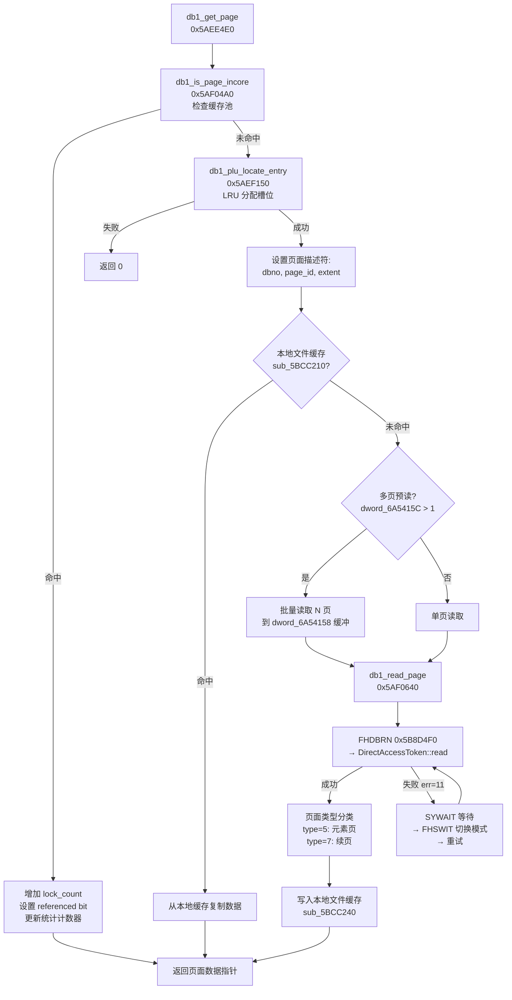
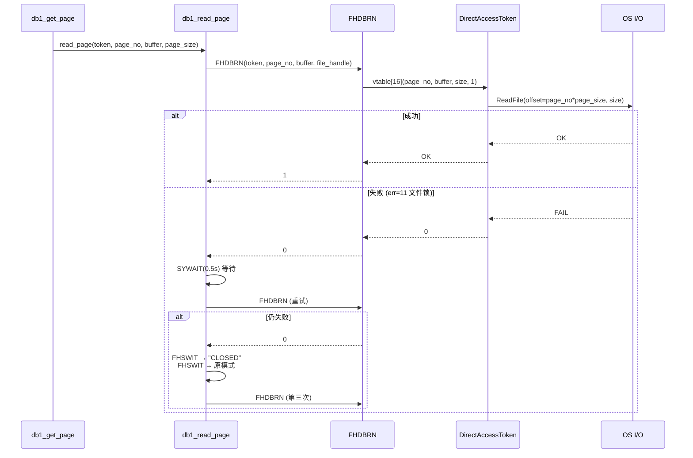
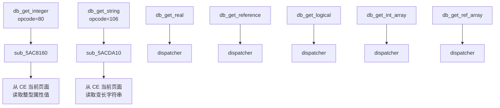
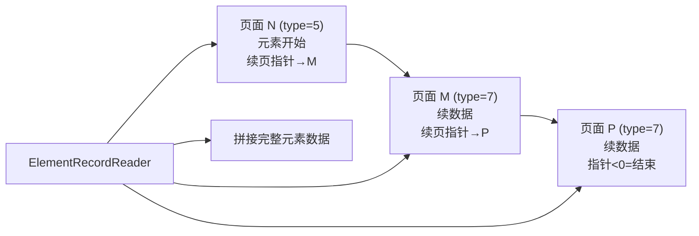
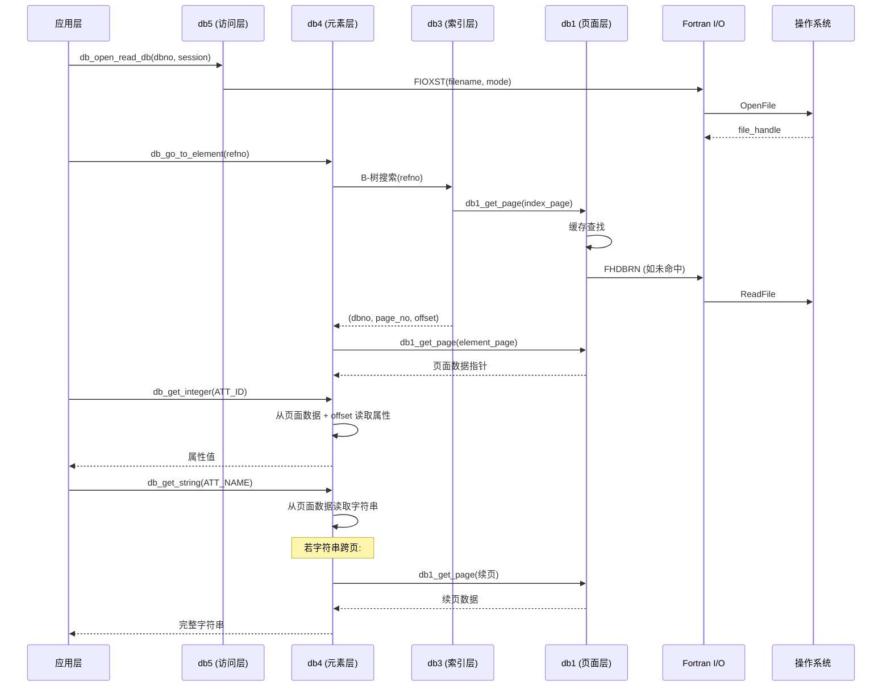

# E3D/PDMS 数据库读取解析架构（E3D 3.1）

> 基于 core.dll 逆向分析 + pdms-io-fork Rust 实现对照

## 1. 总览



## 2. 阶段一：打开数据库

### 2.1 调用链

```
DB_DB::openRead(session_no)                    // C++ 入口
  → DB_DB::openFile(mode=7)                    // 0x590BAC0
    → QU_Buffer::Append(project_path)
    → FIOXST(filename, dbno*100+mode, ...)     // Fortran: 打开已有文件
    → DB_DB::addToTokenLookup()                // 注册 token 到查找表
    → 设置 openMode = "FILEREAD"
```

### 2.2 文件名构造


`DB_DB::appendDBFileName` (0x58F4F10) 将 db 编号补零到 3 位：

```
dbno=1  → "001"
dbno=5  → "005"
dbno=42 → "042"
```

完整路径: `<project_dir>/<project_name>001` ~ `<project_name>NNN`

### 2.3 文件打开模式

| mode 参数 | 含义 | openMode 字符串 |
| :--- | :--- | :--- |
| 7 | 只读 | `FILEREAD` |
| 1 | 只读 | `FILEREAD` |
| 6 | 共享读 | `FILEREAD` |
| 其他 | 读写 | `FILEWRITE` |

实际 FIOXST 参数: `dbno * 100 + mode`，如 db1 只读 = 107。

---

## 3. 阶段二：元素定位

### 3.1 导航到目标元素

```
db_go_to_element(element_ref)                  // opcode=108
  → dispatcher sub_5ACF400
    → 将 CE (Current Element) 指针移动到目标元素
    → 内部通过 B-树索引定位页面
```

### 3.2 B-树索引查找 (db3)



B-树节点结构（从 FHSRCH 反编译推断）:
- 每个索引页包含有序的 key-value 对
- key = 元素 hash 或 refno
- value = (dbno, page_no, offset)

### 3.3 DB_IndexTableIterator

```
DB_IndexTableIterator::ctor(db, element)       // 0x5A19150
  → 初始化搜索上下文
  → 定位第一个匹配的索引条目

DB_IndexTableIterator::increment()             // 0x5A1AD00
  → 移动到下一个索引条目
  → 用于遍历所有匹配元素
```

---

## 4. 阶段三：页面读取 (db1)

### 4.1 db1_get_page 完整流程



### 4.2 页面缓存命中检查 (db1_is_page_incore)

`sub_5AF04A0` 遍历页面描述符池 `dword_6A540EC`，匹配 (dbno, page_id, extent)。

返回值:
- 0 = 未命中
- N > 0 = 缓存池中的 pfno (physical frame number)

### 4.3 磁盘读取重试机制



---

## 5. 阶段四：属性解析 (db4)

### 5.1 属性读取分派



### 5.2 元素页面数据布局

从 `db1_get_page` 返回的页面数据（type=5 元素页）内部结构：

```
┌──────────────────────────────────────────────────┐
│ 页头 (page header)                                │
│   word[0]: page_type (5=元素页, 7=续页)           │
│   word[1]: magic/tag                              │
│   word[2]: 元素计数                                │
│   word[3]: 下一页链接 (negative = 最后)            │
├──────────────────────────────────────────────────┤
│ 元素记录 0                                        │
│   ├─ 元素类型 hash (db1_hash 计算)                │
│   ├─ 固定属性区 (FOWN, LOWN, PREX, NEXX...)      │
│   ├─ 可变属性区 (NAME, DESC, 用户属性)            │
│   └─ 续页指针 (若数据超过一页)                     │
├──────────────────────────────────────────────────┤
│ 元素记录 1 ...                                    │
├──────────────────────────────────────────────────┤
│ 空闲空间 / 填充                                   │
└──────────────────────────────────────────────────┘
```

### 5.3 跨页读取 (续页 type=7)

当元素数据超过单页时，通过 0x07 段合并机制拼接:



---

## 6. 完整读取调用链（端到端）



## 7. 与 pdms-io-fork 的对应

| 解析阶段 | core.dll 函数 | pdms-io-fork (Rust) |
| :--- | :--- | :--- |
| 打开文件 | `FIOXST` → OS Open | `File::open(path)` |
| 页面读取 | `db1_get_page` → `FHDBRN` | `PageManager::get_page` → `read_page_from_file` |
| 页面缓存 | 描述符池 `dword_6A540EC` | `PageManager.cache` HashMap |
| 跨页拼接 | type=7 续页链接 | `ElementRecordReader::read` (0x07 continuation) |
| 属性解析 | `db_get_integer/string/...` | `io.rs` 中的 `read_*` 系列方法 |
| B-树索引 | `FHSRCH/FHXPND/FHITER` | `io.rs` 中的 `find_refno` / `find_key` |
| 页面大小探测 | `dword_6453DC4 × 4` | `defines::PAGE_SIZE_512` / `PAGE_SIZE_2K` |
